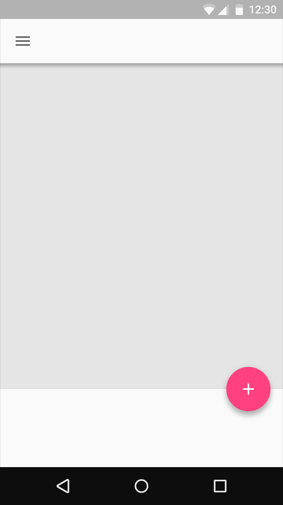

# 按钮：浮动操作按钮

> 浮动操作按钮  
> 运行方式  
> 过渡  
> 大屏幕

## 浮动操作按钮   

### 浮动操作按钮    

浮动操作按钮适用于进阶的操作。它是漂浮在 UI 上的一个圆形图标，具有一些动态的效果，比如变形、弹出、位移等等。

浮动操作按钮有两种尺寸：
- 默认尺寸：适用于多数应用情况。
- 迷你尺寸：仅用于创建与其他屏幕元素视觉的连续性。

浮动操作按钮

   

迷你浮动操作按钮

浮动操作按钮应至少放在距手机边缘 16dp 或电脑/台式机边缘 24dp 的地方。

     

浮动操作按钮红线。

    

迷你浮动操作按钮红线

浮动操作按钮在被聚焦时会出现水墨，在被选中时会弹出来。

<video crossorigin="anonymous"  loop  controls width="760" height="350">
<source src="http://materialdesign.qiniudn.com/videos/components-buttons-fab_01_xhdpi_002.mp4">
</video>

浮动操作按钮获得焦点

<video crossorigin="anonymous"  loop  controls width="760" height="350">
<source src="http://materialdesign.qiniudn.com/videos/components-buttons-fab_02_xhdpi_002.mp4">
</video>

浮动操作按钮被选中

不是每个屏幕都需要浮动操作按钮。一个浮动操作按钮能够代表这个 App 中的主要操作

 (上图)可取：主要操作是在画廊里触摸图片，所以不需要任何按钮。

 (上图)可取：主要操作是添加文件夹。

一个屏幕只推荐使用一个浮动操作按钮来增加其显著性。它应该只代表最常见的操作。

   

 (上图)不可取

  

 (上图)不可取

### 特性   

用浮动操作按钮进行积极的操作，如创建、收藏、分享、浏览和探索。

   

 (上图)可取

避免用浮动操作按钮进行下面这些轻微破坏性操作：
- 存档或删除
- 非特异性操作
- 警报或错误
- 限制性任务如剪切文本
- 控制应放在一个工具栏中，如音量控制或改变字体颜色

浮动操作按钮不包含 app 图标或状态栏通知。不要把证章或者其他元素层叠在浮动操作按钮上

   

 (上图)不可取

APP 主要操作的图案强制使用圆形图标

  

 (上图)可取

 

 (上图)不可取

不要给浮动操作按钮额外的维度。

    

 (上图)可取

 

 (上图)不可取

## 运行方式   

### 运行方式   

在默认情况下，浮动操作按钮就像一块扩展的物体在屏幕上活动。在它里面的图标可能是活动的。

浮动操作按钮因为其相对重要性，可能以不同于其他 UI 的方式在屏幕上出现和移动。要考虑各元素出现的位置和怎样把浮动操作按钮放到合适的位置上去。

<video crossorigin="anonymous"  loop  controls width="760" height="350">
<source src="http://materialdesign.qiniudn.com/videos/components-buttons-fab-behavior_01_xhdpi_012.mp4">
</video>

<video crossorigin="anonymous"  loop  controls width="760" height="350">
<source src="http://materialdesign.qiniudn.com/videos/components-buttons-fab-behavior_02_xhdpi_012.mp4">
</video>

如果在多个旁边的屏幕上有浮动操作按钮（比如选项卡），在进入屏幕时，若在每个屏幕上的操作不同，按钮应该显示和隐藏。若操作相同，按钮应该停留在屏幕上（如果有需要，转换到新的位置上）

<video crossorigin="anonymous"  loop  controls width="760" height="350">
<source src="http://materialdesign.qiniudn.com/videos/components-buttons-fab-behavior_03_xhdpi_001.mp4">
</video>

 (上图)可取

<video crossorigin="anonymous"  loop  controls width="760" height="350">
<source src="http://materialdesign.qiniudn.com/videos/components-buttons-fab-behavior_04_xhdpi_009.mp4">
</video>

 (上图)可取

对于带有标签的屏幕，浮动操作按钮不应朝着屏幕退出时的同一方向退出屏幕。否则会导致视觉噪音。这也将导致在屏幕上出现一个失灵的浮动操作按钮。此外，它错误地暗示了浮动操作按钮与内容在相同的 Z 水平高度上，而不是在根水平高度中 UI 主元素所在的水平高度的上。

<video crossorigin="anonymous"  loop  controls width="760" height="350">
<source src="http://materialdesign.qiniudn.com/videos/components-buttons-fab-behavior_05_xhdpi_009.mp4">
</video>

 (上图)不可取

<video crossorigin="anonymous"  loop  controls width="760" height="350">
<source src="http://materialdesign.qiniudn.com/videos/components-buttons-fab-behavior_06_xhdpi_009.mp4">
</video>

 (上图)不可取

## 过渡   

### 过渡   

浮动操作按钮在 app 中，是其一个主要用途的独特例子。利用它的可见性可为一个主要的 UI 元素创造愉快的过渡。

通常过渡包括触发器、工具栏、快速拨号以及变形。当然远不止这些。浮动操作按钮被设计的很灵活。你可以实验出最适合你的应用和屏幕的过渡效果。

### 触发器   

浮动操作按钮可以只是简单地触发一个操作或是某处的导航。触摸脉动的动画随着导致变化的力量而向外扩张。

<video crossorigin="anonymous"  loop  controls width="760" height="350">
<source src="http://materialdesign.qiniudn.com/videos/components-buttons-fab-transition_trigger_01.mp4">
</video>

一个浮动操作按钮可以简单地触发一个操作。

<video crossorigin="anonymous"  loop  controls width="760" height="350">
<source src="http://materialdesign.qiniudn.com/videos/components-buttons-fab-transition_trigger_02.mp4">
</video>

浮动操作按钮让地图视图回到中心位置

App 通常使用一个单一的浮动操作按钮。然而，本例使用了两个浮动操作按钮，因为它们执行同样重要但独特的操作。

### 工具栏   

浮动操作按钮可在按下时或从滚动工具栏转换为工具栏。工具栏可以包含相关的操作、文本和搜索方面功能，或者任何手边有用的部件。

<video crossorigin="anonymous"  loop  controls width="760" height="350">
<source src="http://materialdesign.qiniudn.com/videos/components-buttons-fab-transition_toolbar_01.mp4">
</video>

浮动操作按钮变成一个工具栏

<video crossorigin="anonymous"  loop  controls width="760" height="350">
<source src="http://materialdesign.qiniudn.com/videos/components-buttons-fab-transition_toolbar_02.mp4">
</video>

浮动操作按钮变成一个工具栏

一个工具栏在滚动条上消失对屏幕来说非常有用。而整个工具栏在屏幕的初始输入或一个长列表的顶部或底部时非常需要。

<video crossorigin="anonymous"  loop  controls width="760" height="350">
<source src="http://materialdesign.qiniudn.com/videos/components-buttons-fab-transition_scrolltoolbar_01.mp4">
</video>

工具栏在滚动时转变成一个浮动操作按钮

<video crossorigin="anonymous"  loop  controls width="760" height="350">
<source src="http://materialdesign.qiniudn.com/videos/components-buttons-fab-transition_scrolltoolbar_02.mp4">
</video>

工具栏在滚动时转变成一个浮动操作按钮

如果一个浮动行为按钮变成一个工具栏，那么这个工具栏应包含相关的操作功能。

   

 (上图)可取：在这个例子中，按钮可以让用户选择媒体类型来添加。

   

 (上图)不可取：不要包括不相关或者混乱不清的操作。

### 快速拨号   

浮动动作按钮可在按下时将相关动作实现。按钮在菜单被调用后应扔保留在屏幕上。点击同一点应能够激活最常用的操作或关闭已打开的菜单。

<video crossorigin="anonymous"  loop  controls width="760" height="350">
<source src="http://materialdesign.qiniudn.com/videos/components-buttons-fab-transition_speeddial_01.mp4">
</video>

一个浮动的操作按钮能够释放相关的操作。

<video crossorigin="anonymous"  loop  controls width="760" height="350">
<source src="http://materialdesign.qiniudn.com/videos/components-buttons-fab-transition_speeddial_02.mp4">
</video>

一个浮动的操作按钮能够释放相关的操作。

浮动操作按钮可以转变为一个包含所有操作的 material 单页。

<video crossorigin="anonymous"  loop  controls width="760" height="350">
<source src="http://materialdesign.qiniudn.com/videos/components-buttons-fab-transition_card_01.mp4">
</video>

一个浮动按钮转变为一个 material 单页

<video crossorigin="anonymous"  loop  controls width="760" height="350">
<source src="http://materialdesign.qiniudn.com/videos/components-buttons-fab-transition_card_02.mp4">
</video>

一个浮动按钮转变为一个 material 单页

作为一个通用规则，按动按钮时保持三个以上的选项，但不要超过六个，包括原来的浮动操作按钮。如果你有两个选项，即，你的浮动操作按钮只弹出了另外一个选项——选择哪个操作是最重要的。如果选项超过六个，用户可能在选择上有困惑。

通过给予用最好、最显眼以及最少的选项来减少选择疲劳。

   

一个浮动操作按钮至少应该弹出三个以上的选项。

  

一个浮动操作按钮应该弹出不超过六个选项。

不要在浮动操作按钮的选项中放置外链按钮。从原始屏幕到目的页面应该最多两次点击。

  
  

选项应该指明目的页面。

   

选项不应该包含外链菜单。

将外链操作放置在工具栏的外链菜单中，而不是放置在浮动操作按钮中。

    

外链菜单在工具栏中。

外链菜单在工具栏中。

  

浮动操作按钮并非弹出菜单。

   

浮动操作按钮并非弹出菜单。

如果一个应用的主题时添加文件类型，浮动操作按钮在首次被点击后可以转换为相关的操作。如果出现的操作是与按钮不相关的，将操作放到弹出菜单中。

   

浮动操作按钮可以转变为相关操作。

   
 
浮动操作按钮不应该转变为不相关的操作。

浮动操作按钮可以包含一个联系人列表。这个列表不应该包含不相关的操作。

  

浮动操作按钮可以转变为一个联系人列表。

   

浮动操作按钮不应该转变为不相关的操作。

### 变形   

浮动操作按钮可以转变为 material 单页，app 结构中的部分。这个神奇的转变突出了按钮可以做的操作。

当浮动操作按钮变形时，在开始和结束位置之间以合理的方式转换。例如，不要穿过其他的 material 单页。

变形动画应该是可逆的，可以将新的 material 单页变回为浮动操作按钮。

<video crossorigin="anonymous"  loop  controls width="760" height="350">
<source src="http://materialdesign.qiniudn.com/videos/components-buttons-fab-transition_morph_01.mp4">
</video>

浮动操作按钮可以变形为一个 material 单页，app 结构中的一部分。

<video crossorigin="anonymous"  loop  controls width="760" height="350">
<source src="http://materialdesign.qiniudn.com/videos/components-buttons-fab-transition_morph_02.mp4">
</video>

浮动操作按钮可以变形为一个 material 单页，app 结构中的一部分。

### 满屏   

浮动动作按钮可以转变成占满整个屏幕的新型物品。

这种戏剧性的转变通常与创造新的内容相关。其结果是，它不趋向于具有撤销转变或可逆操作的方法

<video crossorigin="anonymous"  loop  controls width="760" height="350">
<source src="http://materialdesign.qiniudn.com/videos/components-buttons-fab-transition_fullscreen_01.mp4">
</video>

浮动动作按钮可以转变成占满整个屏幕的新型物品。

<video crossorigin="anonymous"  loop  controls width="760" height="350">
<source src="http://materialdesign.qiniudn.com/videos/components-buttons-fab-transition_fullscreen_02.mp4">
</video>

浮动动作按钮可以转变成占满整个屏幕的新型物品。

## 大屏幕   

### 大屏幕   

浮动操作按钮可以附属到一个扩展的 app bar。

 

 (上图)可取

浮动操作按钮可以被附属到单页中的一个工具栏或者结构化元素（只要没有阻碍其他元素）。

    

 (上图)可取

浮动操作按钮可以被附属到一个单页的边缘。

   

 (上图)可取

单个屏幕上不要多与一个浮动操作按钮。

   

 (上图)不可取

不要将浮动操作按钮与屏幕上的每个元素都联系起来。

   

 (上图)不可取
