# 数据表   

数据表被用来展示原始数据集，并且通常出现于桌面企业产品中。

数据集可能包含：
- 三个或者更多列的数据
- 一个相关的可视化
- 用户可以批量查询、操作数据

> 结构  
> 交互  
> 选择行  
> 规格  

## 结构   

在最简单的形式中，一个数据表包含列名称的顶层行，以及许多数据行。如果用户需要选择或者操作数据，每一行应该有一个复选框。

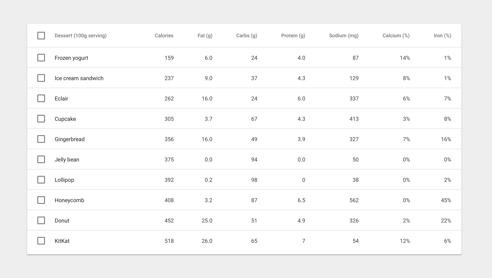   

基本数据表

**列头部**
- 12 sp Roboto Medium
- 54% 黑色

**表内容**
- 13sp Roboto Regular
- 87%黑色

**文本对齐**
- 右对齐数据列
- 左对齐文本列

## 交互   

### 悬停行（桌面）   

当用户悬停到一行任意位置时，显示一个背景。如果个别的单元格有特别的悬停状态，同时显示单元格和行的状态。

**悬停背景**
- 灰色 200 (#EEEEEE)

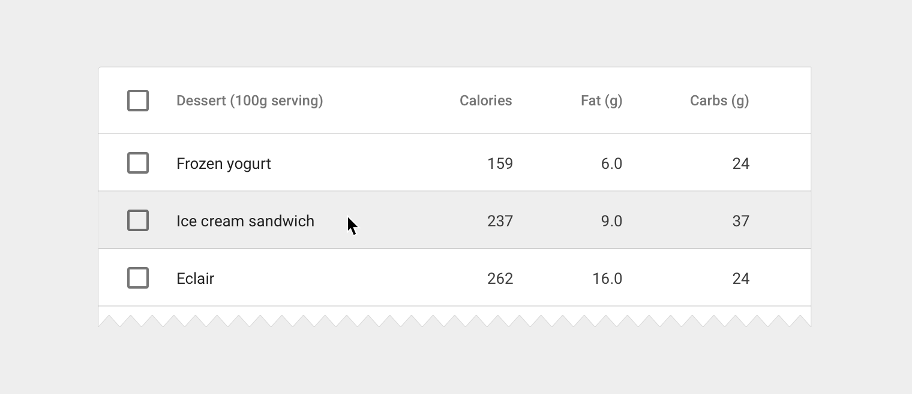   

悬停于一行

## 选择行
当一行被选中，在当前行使用背景。

**选中行背景**
- 灰色100 (#F5F5F5)

**复选框**
- 使用第二个应用颜色

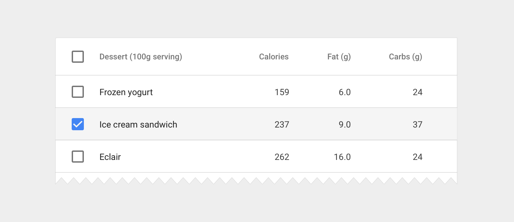   

一个选中的表格行

### 排序列
如果列排序被使能，默认排列最重要的数据，并且在列头部显示已排序的状态。如果用户点击一个已排序的列，反转排序顺序并且旋转排序图标。

**排序的列名称**
- 12sp Roboto Medium
- 87% 黑色

**排序图标**
- 16dp container
- 87% 黑色

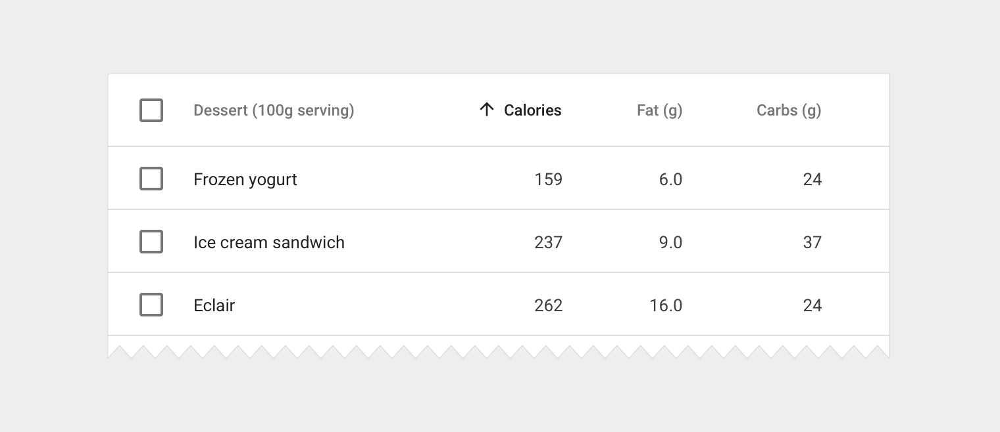   

带有正向排序列的表

### 悬停列名称（桌面）
如果需要提供列名称的定义，悬停时显示一个提示文本。如果可以排序，悬停时显示一个明亮的排序按钮，指明这个列是可以排序的。

**提示文本**
- 遵守提示文本指南

**排序按钮**
- 16dp container
- 26% 黑色

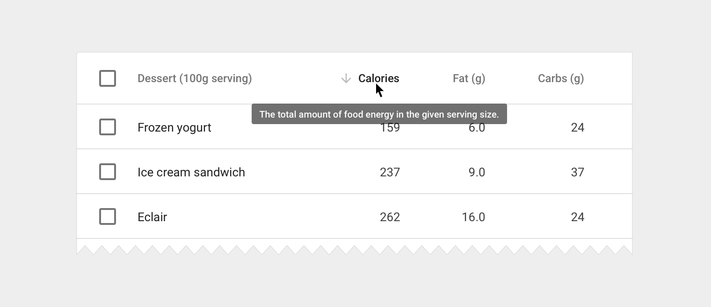   

悬停于一个列名称

### 长头部标题   

有时，列之间采用推荐的 56 dp 内边距时，列名称在容器中并不合适。有两个选项来处理这种情况：

- 1.完整显示列名称，在表格容器中使能垂直滚动条。
- 2.缩减列名称，悬停时显示全部。

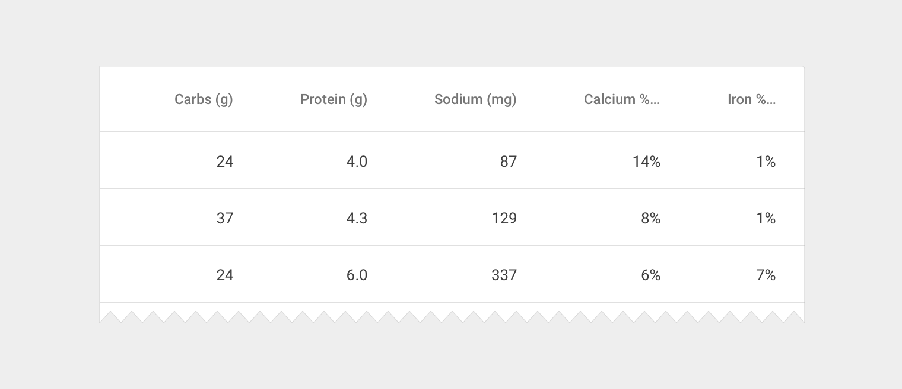   

通过一个椭圆阶段长的列名称

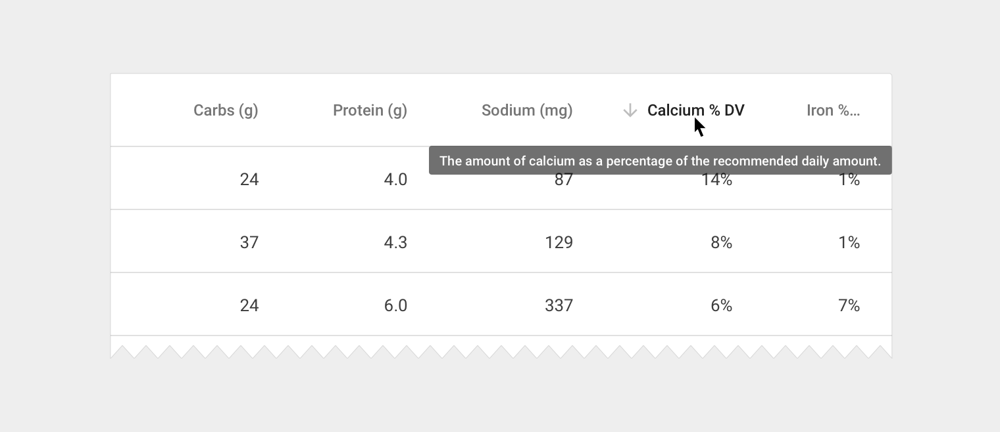    

悬停于一个截断的列名称

### 内联文本编辑   

表格可能需要基本的文本编辑（例如，编辑现有的文本内容，或者添加评论）。在表中包含可编辑字段，通过使用 placeholder 文本来提示。你可以使用一个简单的编辑对话框，只放一个文本框，当然也可以显示一个完整的对话组件。

**Placeholder 文本**
- 13sp Roboto Regular
- 26% 黑色
- 文本框中没有分割线

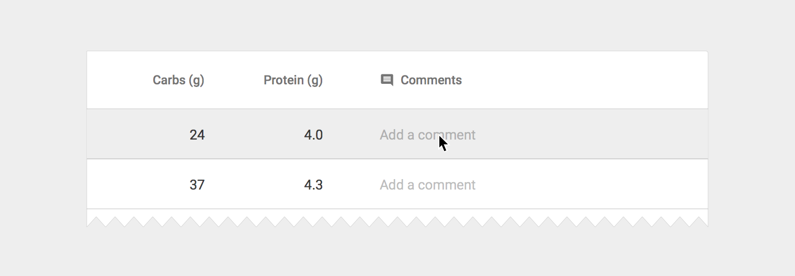

**小的编辑对话框**
- 将对话框的边缘与最近的分割线对齐，或者表格边缘
- 24 dp 的左边距和右边距
- 包含单个的文本框，应用 app 主题
- 用户通过按动回车键确认

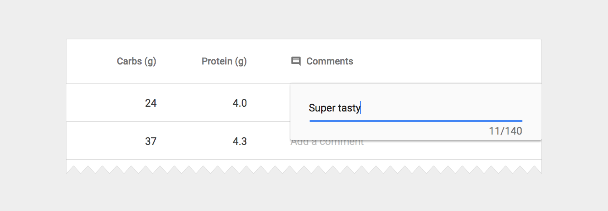   

一个简单、单字段的编辑对话框

**大的编辑对话框**
- 将对话框的边缘与最近的分隔线或者表格边缘对齐
- 遵从对话框指南，应用 app 主题
- 用户通过点击保存按钮确认文本

   

一个复杂灵活的编辑对话框

**内联编辑按钮**
- 18 dp 容器
- 54% 黑色

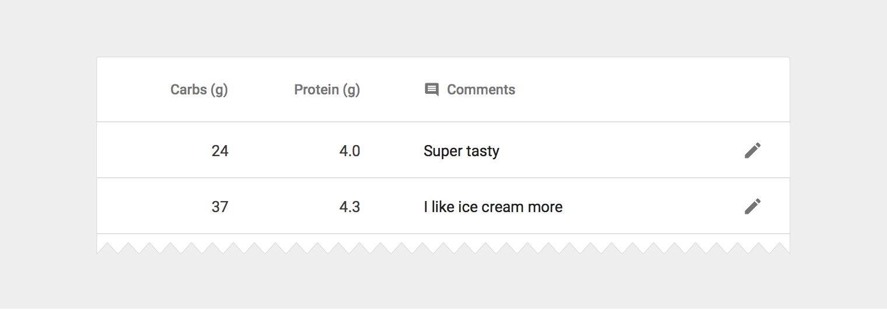   

（可选）基于图标的编辑提示。在内容的另一边的单元格边缘包含图标。

**内联菜单**
除了编辑文本框，用户可能需要从一个预定义的选项列表中选择。在这种场景中，直接在表格中嵌入一个菜单组件。

**内联菜单**
- 13sp Roboto Regular
- 87% 黑色
- 遵循菜单的空间和尺寸指南

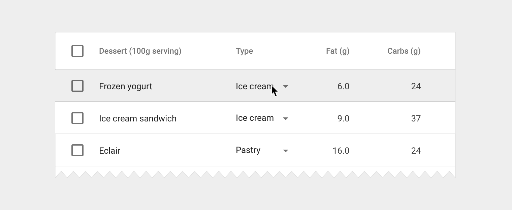   

带有内联菜单的表格

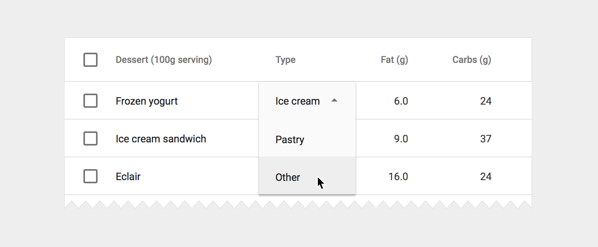   

一个扩展的内联菜单

## 卡片中的数据表   

数据表可以被嵌入到卡片中，在顶部和底部放置导航和数据操作工具。

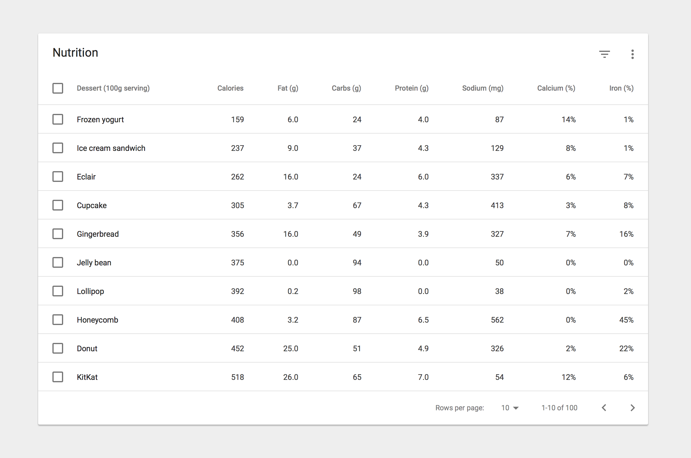   

具有头部和脚部的表格卡片

**卡片标题**
- 20sp Roboto Regular
- 87% 黑色

**卡片操作图标（头部和脚部）**
- 24dp container
- 54% 黑色

**脚部分页标签**
- 12sp Roboto Regular
- 54% 黑色

### 可选头部   

有些表格卡片可能需要带有操作而不是标题的头部。这种情况，两个可能的方法：显示持续的操作菜单，或者当条目选中时激活一个内容头部。

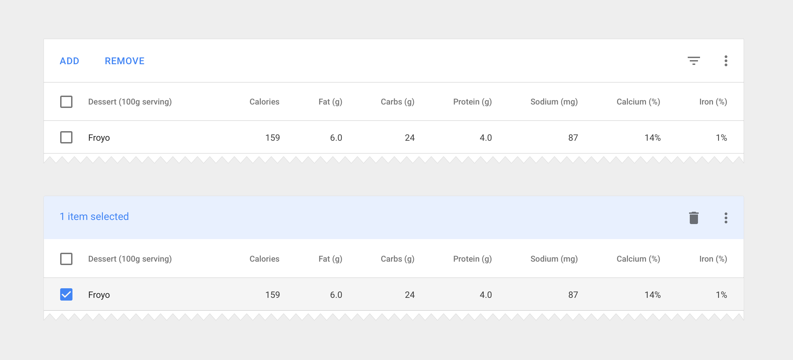   

一个表格卡片的可选头部

#### 操作按钮   

- 使用无边框按钮
- 使能条目选择

#### 着色的头部   

- 为背景使用 50 -值的第二应用颜色
- 显示选中条目的数量
- 在条目选择上显示可用的内容图标

## 规格   

### 垂直间距

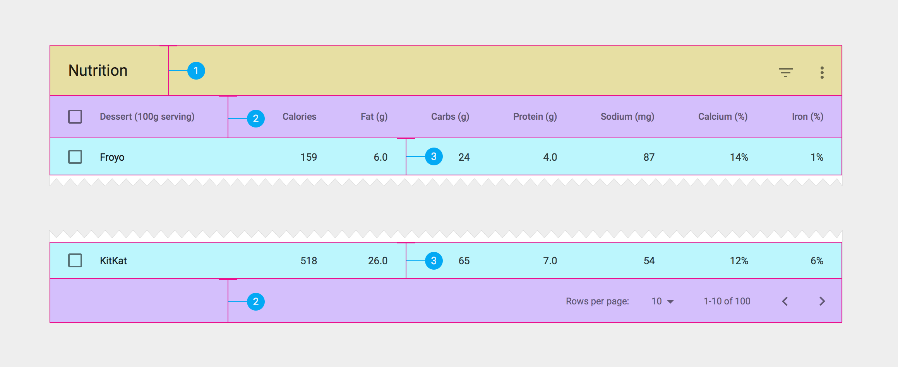   

一个数据表的垂直间距以及它的最后行

- 1.64 dp 的卡片头部高度
- 2.56 dp 的最后行高度
- 3.48 dp 的数据行高度

### 头部以及脚部内边距

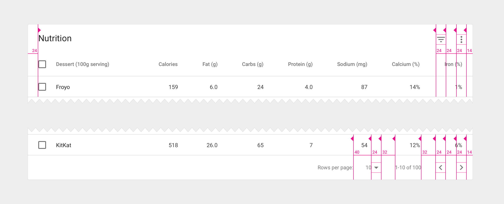    

数据表卡片中的元素之间的水平内间距。
- 数据表卡片的一周有 24 dp 的内边距
- 脚部控制菜单中，32 dp 的内边距
- 脚部行数量和标签之间是 40 dp 的内边距

### 列内边距   

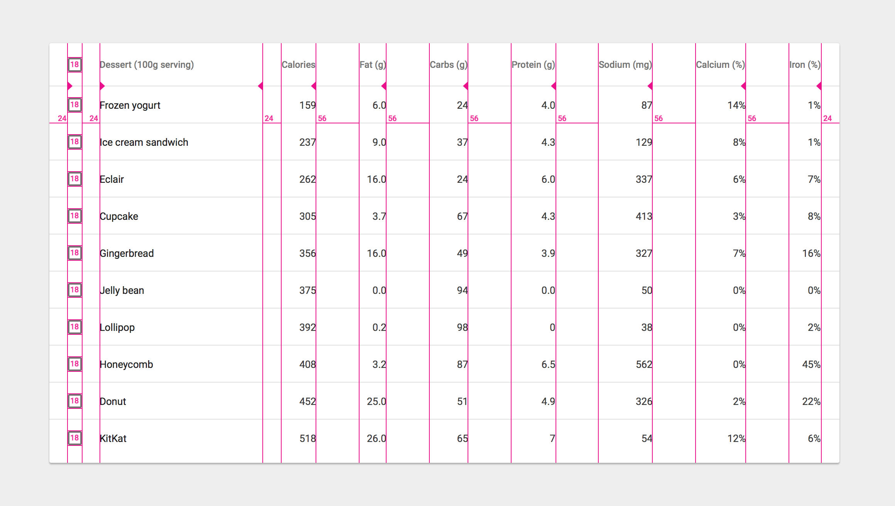   

列之间的内边距   

- 1.列之间的最小内边距为 56 dp。列中最宽的条目（包含数据和列名称）划定列的边框。
- 2.在 24 dp 的图标容器中，复选框图标拥有 18 dp 的宽度和高度。