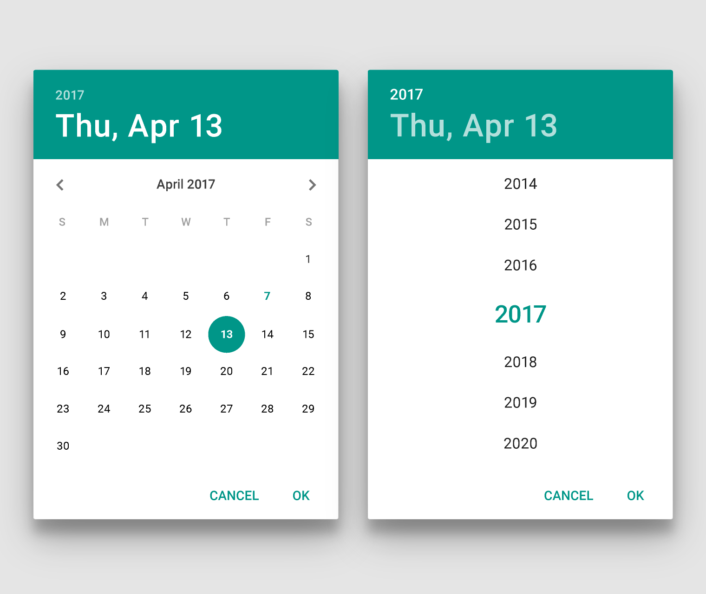
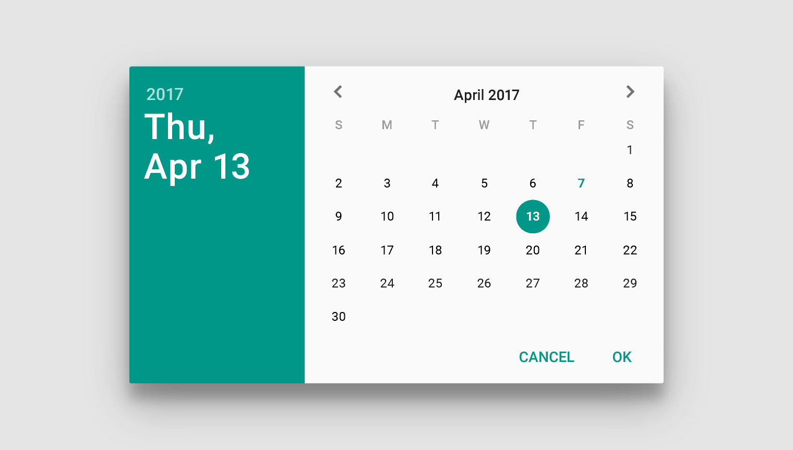
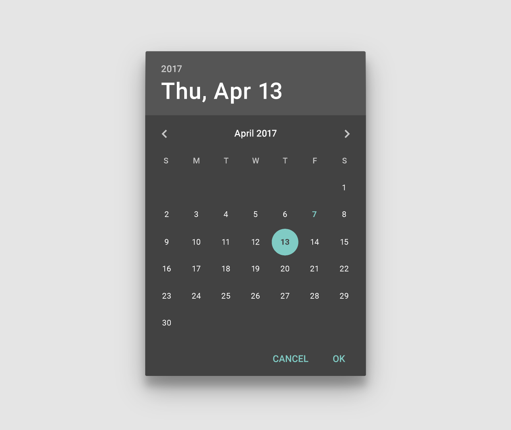
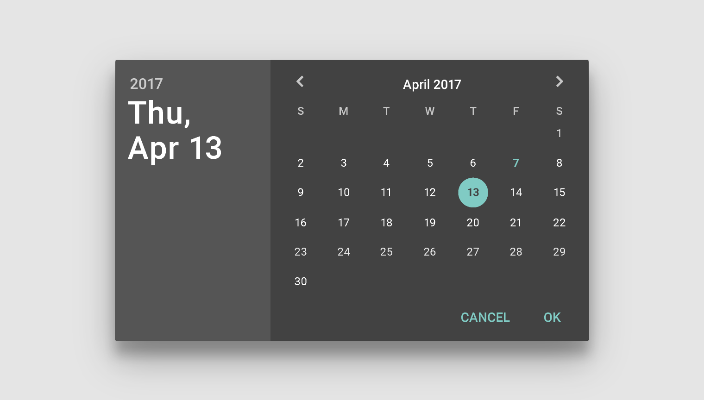
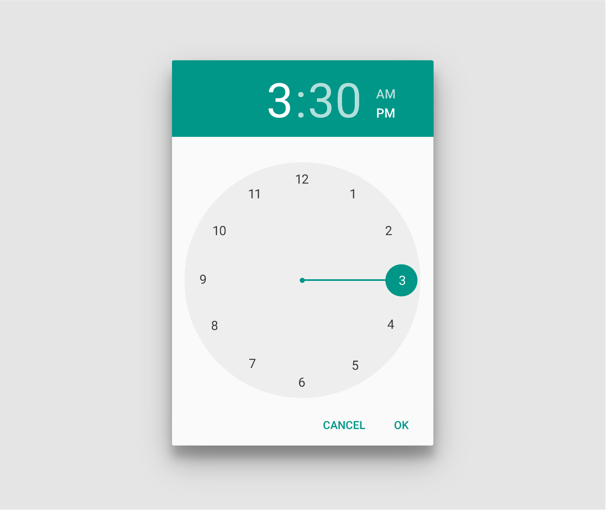
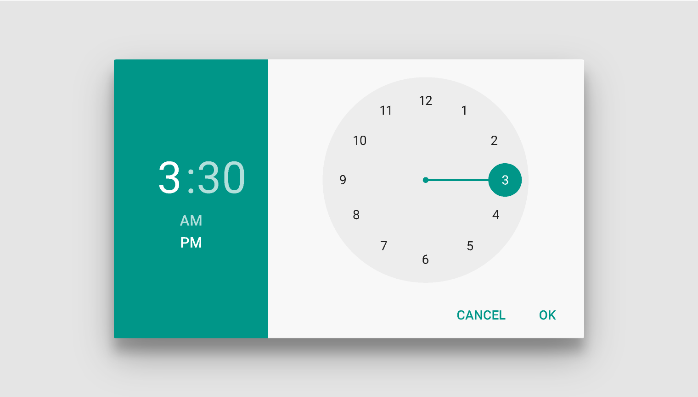
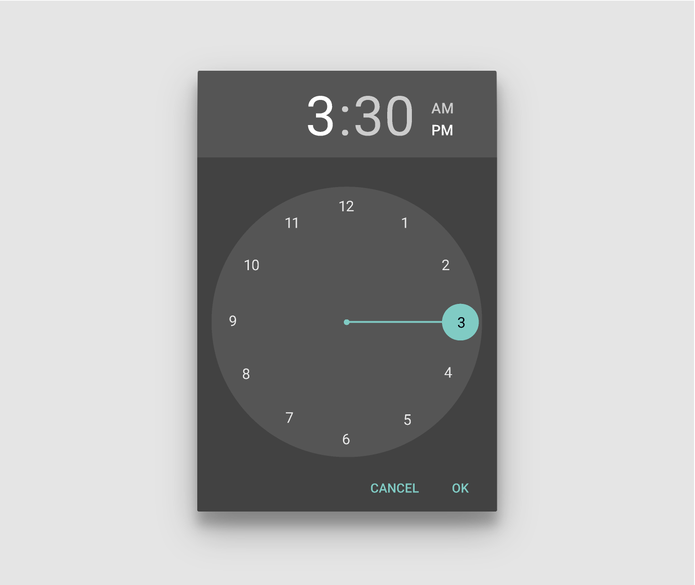
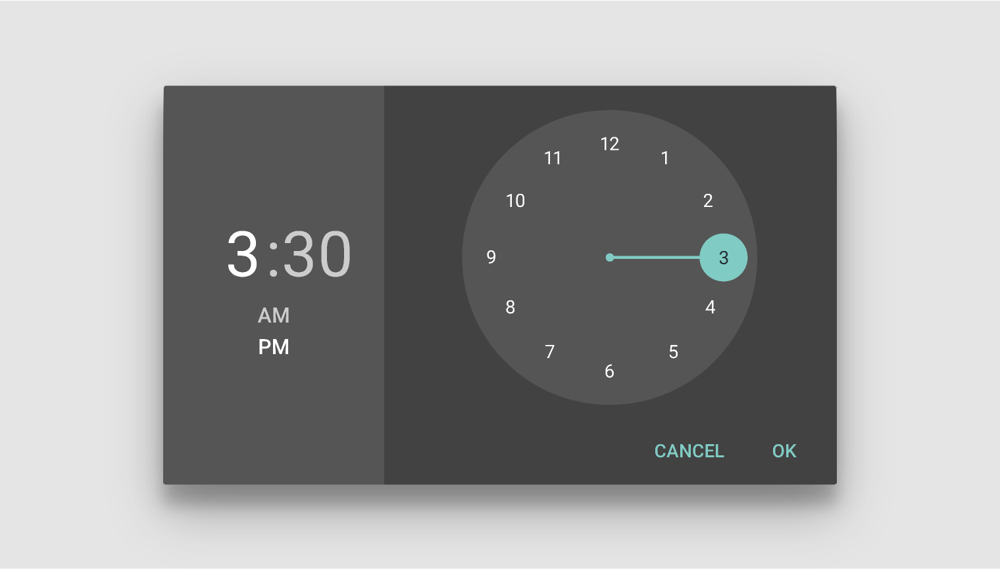

# 选择器   

选择器提供了一个简单的方法来从一个预定义集合中选取单个值。

在手机上，选择器最适合被用来显示一个[确认对话框](https://www.google.com/design/spec/components/dialogs.html#dialogs-confirmation-dialogs)。对于内联显示，例如一个表单中，考虑使用[分段下拉按钮](https://www.google.com/design/spec/components/buttons.html#buttons-other-buttons)之类的紧凑控制。在你的应用中使用这些组件可以帮你保证用户指定的日期或者时间是正确格式化的。

- 日期选择器的格式根据地区自动进行调整，即，美国是月-日-年，其他地区是日-月-年。
- 时间选择器的格式根据用户的喜好进行设定，即，12小时或者 24 小时的格式。

> 日期选择器

> 时间选择器

## 日期选择器   

一个日期选择器在手机上用来选择一个单个日期。

选定的日期由一个实心的圆圈指示。当前日期由一个不同颜色和类型的圆圈指示。

日期和年选择器：白色主题，竖屏

从左滑到右来选择月份。点击标题 bar 中的年份转换到年份页面。

<video crossorigin="anonymous"  loop  controls width="760" height="350">
<source src="http://materialdesign.qiniudn.com/videos/components_pickers_date_navigation_xhdpi_004.mp4">
</video>

日期选择导航

选择器页面自适应于设备的方向。

日期选择器：白色主题，横屏

一个黑色主题的选择器可能与一个黑色主题的应用协调。

日期选择器：黑色主题，竖屏

黑色主题选择器的横屏页面。

日期选择器：黑色主题，横屏

## 时间选择器   

时间选择器被用来在手机上选择单个的时间（小时：分钟）

选中的时间由一个钟表指针终端的实心圆圈指示。

日期选择器：白色主题，竖屏

在标题 bar 中点击小时和分钟标签的中间来切换小时和分钟页面。另外，点击标题 bar 中的 AM/PM 标签来切换 AM 与 PM（在 12 小时的时钟模式下）。

<video crossorigin="anonymous"  loop  controls width="760" height="350">
<source src="http://materialdesign.qiniudn.com/videos/components_pickers_time_transition.mp4">
</video>

时间选择导航

选择页面自适应于设备方向。

时间选择器：白色主题，横屏

一个黑色主题的选择器可以与一个黑色主题的应用协调。

时间选择器：黑色主题，竖屏

黑色主题选择器的横屏页面

时间选择器：黑色主题，横屏
