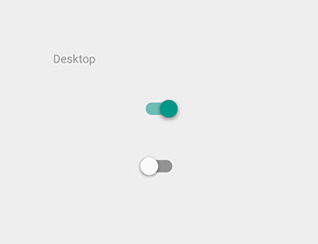

# 选择控制器   

选择控制器允许用户选择选项。有三种类型：复选框、单选框以及开/关切换。选择控制器使用主题同样的颜色。

> 复选框

> 单选按钮

> 切换开关

## 复选框   

复选框允许用户从一个数据集中选择多个选项。

如果在一个列表中有多个选项，你可以通过使用复选框而不是开/关切换来节省空间。

如果你有一个单选项，不要用复选框，使用开/关切换。

白色主题

黑色主题

### 白色   

开: Swatch 500, 透明度 100%

关: #000000, 透明度 54%

失效: #000000, 透明度 26%

白色主题的复选框在悬停、聚焦、按动、失效以及失效聚焦的状态。

### 黑色   

开: Swatch 500, 透明度 100%

关: #FFFFFF, 透明度 70%

失效: #FFFFFF, 透明度 30%

白色主题的复选框在悬停、聚焦、按动、失效以及失效聚焦的状态。

## 单选按钮   

单选按钮允许用户从一个数据集中选择单个选项。如果你觉得用户需要并排看到所有的可选项，使用单选按钮进行排他操作。

此外，考虑使用下拉列表，相对于显示所有的选项占用更少的空间。

白色主题的单选按钮

黑色主题的单选按钮

### 白色   

开: Swatch 500, 透明度 100%

关: #000000, 透明度 54%

失效: #000000, 透明度 26%

白色主题的单选按钮在悬停、聚焦、按动、失效以及失效聚焦的状态。

### 黑色   

开: Swatch 500, 透明度 100%

关: #FFFFFF, 透明度 70%

失效: #FFFFFF, 透明度 30%

黑色主题的单选按钮在悬停、聚焦、按动、失效以及失效聚焦的状态。

## 切换开关   

开/关切换器切换单个设置选项的状态。开关控制器中的选项，以及它所在的状态，应该用伴随的内联标签显示清楚。开关选择器具有和单选按钮一样的视觉属性。

使用文本“开”和“关”滑动切换已经过时了。使用这里显示的开关选择器代替。

白色主题

黑色主题

白色
Thumb On: Swatch 500, 透明度 100%

Track On: Swatch 500, 透明度 50%

Thumb Off: Grey 50, #FAFAFA, 透明度 100%
Track Off: #000000, 透明度 26%

Thumb Disabled: Grey 400, #BDBDBD, 透明度 100%
Track Disabled: #000000, 透明度 12%

白色主题的开关选择器在悬停、聚焦、按动、失效以及失效聚焦的状态。

黑色
Thumb On: Swatch 200, 透明度 100%

Track On: Swatch 200, 透明度 50%

Thumb Off: Grey 400, #BDBDBD, 透明度 100%

Track Off: #FFFFFF, 透明度 30%

Thumb Disabled: Grey 800, #424242, 透明度 100%

Track Disabled: #FFFFFF, 透明度 10%

黑色主题的开关选择器在悬停、聚焦、按动、失效以及失效聚焦的状态。

在手指触控的表单元素上使用外部圆圈反应，这里的交互可能会完全阻碍元素。对于一个使用鼠标的桌面应用，没必要使用这种多余的效果。

手机上的外部反应

桌面应用中没有外部反应
