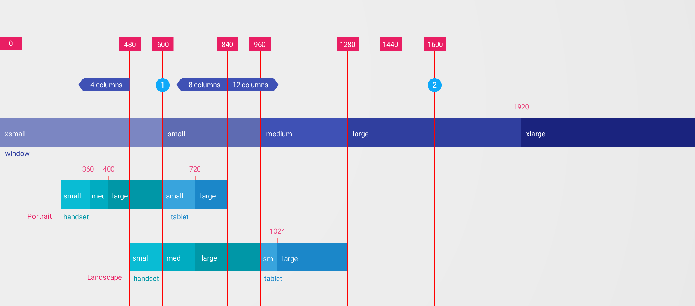
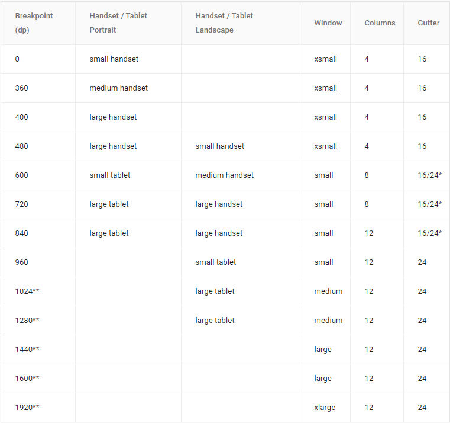
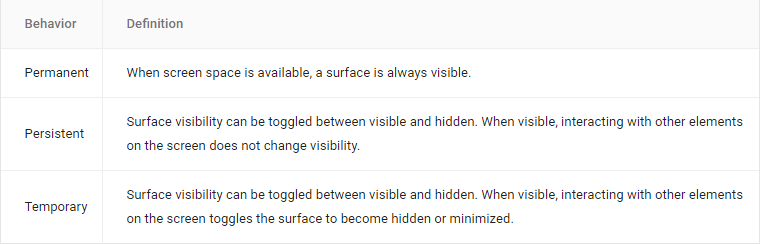
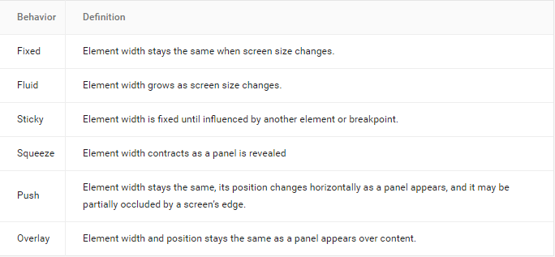
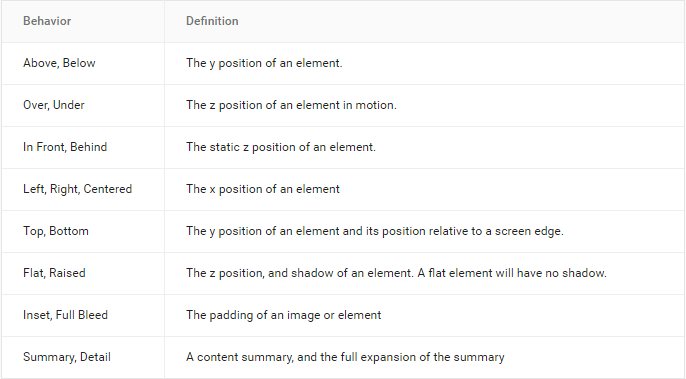
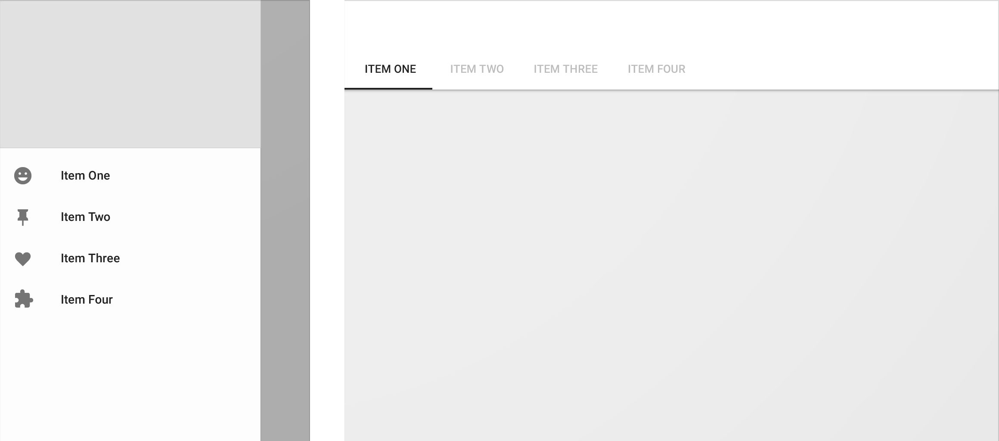
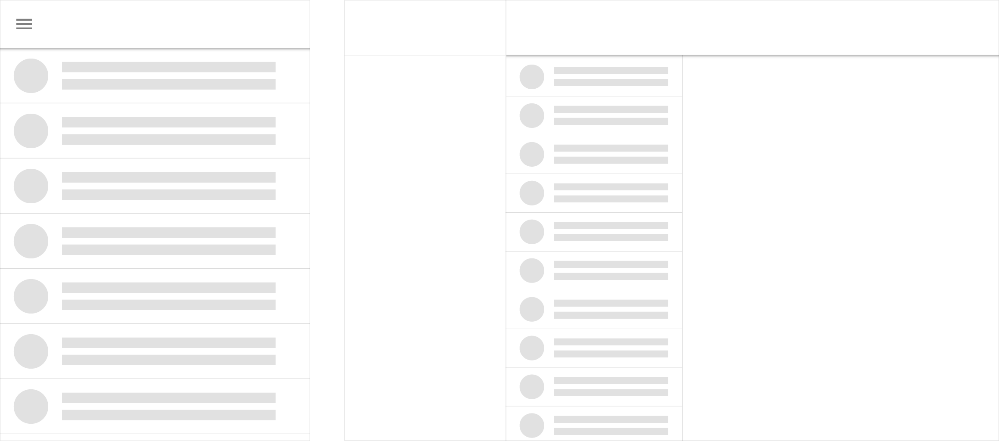
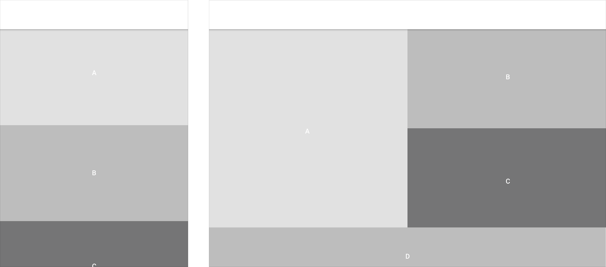
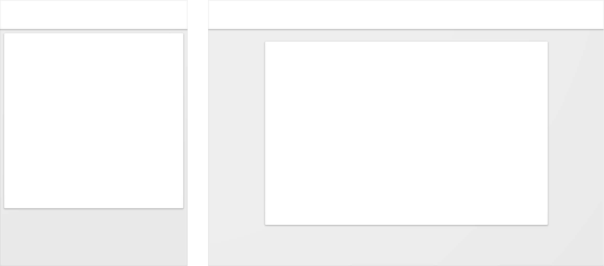

# 自适应 UI    

Material Design 中的响应式布局适用于任何尺寸的屏幕。自适应 UI 手册包含：保证布局一致性的灵活网格、内容如何在不同屏幕上重绘的断点细节以及关于一个应用如何从小的屏幕缩放到超大屏幕的描述。

## 断点   

为了最优的用户体验，Material 用户界面应该适应如下断点宽度的布局：480、600、840、960、1280、1440 以及 1600 dp。

**1.布局中的总结和细节显示内容**

- 600 dp 以下的布局可以通过单个级别的内容层次充满屏幕（要么总结内容，要么细节内容，但不是全部）。
- 超过 600 dp 宽度的布局可以放置两个等级的内容层次（总结和细节内容两者）。

**2.最大屏幕宽度**

超过 1600 dp 宽度的布局可以变大直到最大宽度。目前，网格可以实现下列事情中的一种：   

- 边距增大时保持居中对齐
- 右边距增加时，居左对齐。
- 显示额外内容时，保持增长。

## 断点系统   

这些断点为不同的屏幕、设备以及方向描述了列和宽度规格。

对于某些尺寸，即使设备旋转了值也是不变的。出于这个原因，无论哪个方向的最小宽度都是定值。

*当设备屏幕小于 600 时，最小宽度为 16 dp

**低于所列值时，桌面断点设为 16 dp 来适应谷歌浏览器中的变化。

## 栏栅   

Material design 的自适应 UI 是基于一个 12 列的栏栅布局。这个栏栅提供了不同布局之间的视觉一致性，而又保持了多样化设计的灵活性。栏栅列的数量基于系统断点而变化。

<video crossorigin="anonymous"  loop  controls width="740" height="350">
<source src="http://materialdesign.eoemobile.com/layout_adaptiveUI_grid_01_hero.mp4">
</video>

这个动画效果展示了不同平面和面板是如何排列在一起从而影响上述 12 列栏栅的。

## 外边距与间隔   

适应性栏栅指的是具有恒定的外边距和间隔宽度，而不是列宽度。 Material design 中的外边距和列符合某一 8 dp 的方形基线栏栅。外边距和间隔可以是 8,16,24 或 40 dp 宽。

外边距与间隔没必要相等。例如，在同一个布局中使用 40 dp 的外边距和 24 dp 的间隔是完全可取的。

<video crossorigin="anonymous"  loop  controls width="740" height="350">
<source src="http://materialdesign.eoemobile.com/layout_adaptiveUI_grid_02_margins.mp4">
</video>

这个动画显示了下面这些宽度的外边距和间隔的不同搭配：

1. 8 dp 外边距和间隔
2. 16 dp 外边距和间隔
3. 24 dp 外边距和间隔
4. 40 dp 外边距和间隔
5. 40 dp 外边距和 24 dp 间隔

## 完全宽度栏栅与居中栏栅对比   

完全宽度栏栅使用流体列以及断点来决定一个布局是否需要变化。

居中栏栅使用固定列，当所有列（加上一个固定的外边距）不再适应屏幕，将会重绘布局。

<video crossorigin="anonymous"  loop  controls width="740" height="350">
<source src="http://materialdesign.eoemobile.com/layout_adaptiveUI_grid_03_width.mp4">
</video>   

1. 完全宽度栏栅
2. 居中栏栅

### 面板对栏栅的影响   

如导航模式中定义的，侧边导航可能是永久、持续或者暂时的。这些行为适用于任何面板，不仅仅是侧边导航。

### 永久性   

一个永久的面板存在于自适应栏栅的外面。面板以一个固定的断点显示（当屏幕可以容纳面板）并且排布内容。不存在显示、隐藏面板的控制。

<video crossorigin="anonymous"  loop  controls width="740" height="350">
<source src="http://materialdesign.eoemobile.com/layout_adaptiveUI_grid_04_behaviorPermanent.mp4">
</video>

一个永久面板对于自适应栏栅的影响。

### 侧边面板对栏栅的影响   

这个动画有两个阶段：  

1. 一个永久侧边面板出现，挤压内容和栏栅。当面板保持可视时，内容是可获取的。切换时面板隐藏。
2. 一个临时侧边面板出现，加栏栅内容推出屏幕。点击面板外面，或者面板内的一个条目，隐藏面板。

<video crossorigin="anonymous"  loop  controls width="740" height="350">
<source src="http://materialdesign.eoemobile.com/layout_adaptiveUI_grid_05_behaviorSqueezePush.mp4">
</video>

一个持续面板对自适应栏栅的影响。

### 临时覆盖   

临时面板在不显示时，不会影响栏栅和内容。当被切换到可视时，可以通过点击面板之外的任何地方或者面板内的一个条目来隐藏面板。

<video crossorigin="anonymous"  loop  controls width="740" height="350">
<source src="http://materialdesign.eoemobile.com/layout_adaptiveUI_grid_06_behaviorOverlay.mp4">
</video>

临时面板对自适应栏栅的影响。

## 表现行为   

当屏幕尺寸变化时，UI 采用下面指定的表面行为来适应。

可见性  

宽度  

描述  

## 模式   

当更多的屏幕空间可用时，下面的模式可以被应用。

### 展现   

展现隐藏的 UI。

   

例如一个侧边导航元素可以变得可视。

### 转换
UI 可以从一种形式转换为另一种。

侧边导航可以转换为 tab。

### 分隔
分隔之前被放置于新建空间的 UI。

空间允许的话，侧边导航、总结内容以及细节内容在同一个页面中被分隔开。

### 重绘
在允许的空间中重绘 UI。

通过边上元素的多样结合，元素可以从单列形式重绘为充满内容空间。

### 扩展   

增长 UI 以占据更多的空间。

内容卡片可以扩展以占据更多的水平空间。
