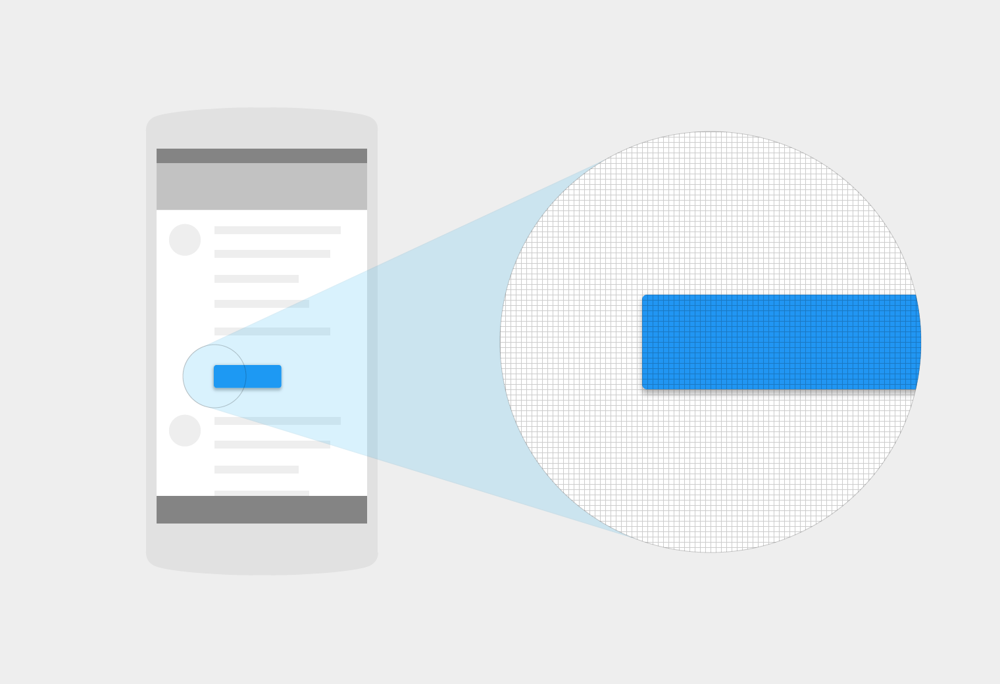
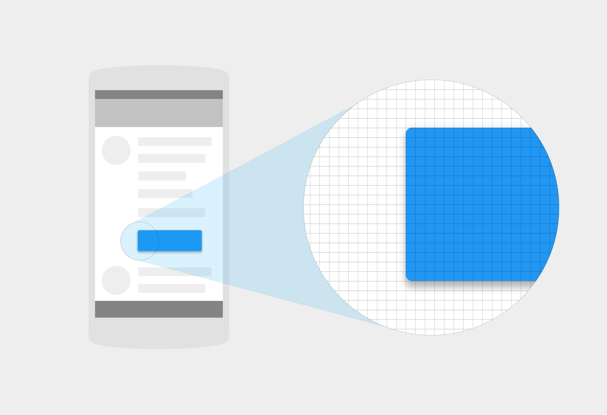
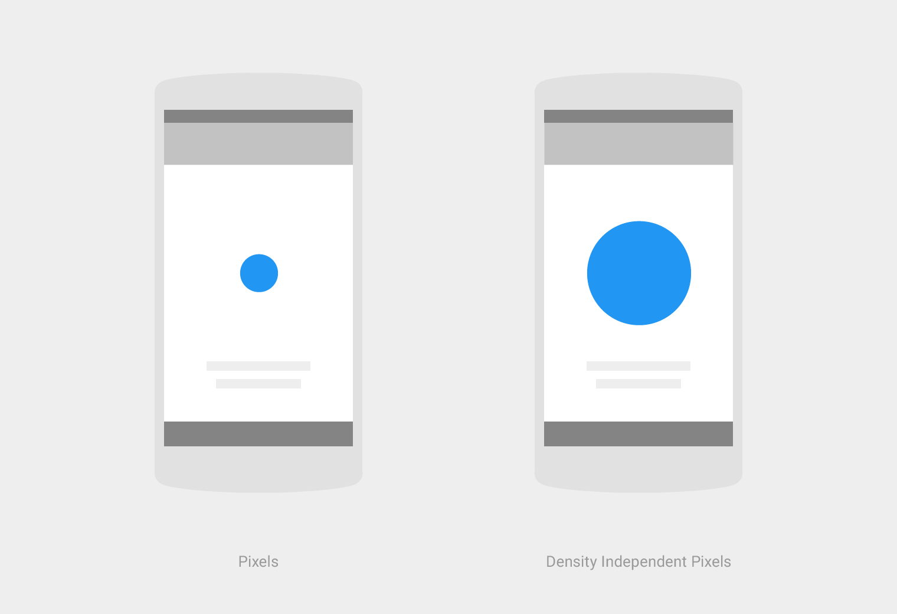
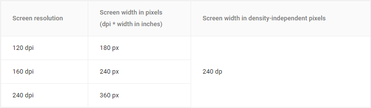
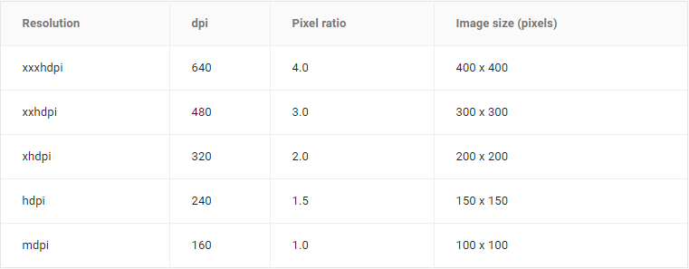

# 单位和度量   

有些单位在不同的语境中有不同的含义。这章论述了独立设备像素，可扩展像素的使用方法以及如像素密度的概念。

> 像素密度

> 密度独立像素

> 可扩展像素（sp）

> 为 DP 设计布局

> 图像缩放

## 像素密度   

每英寸的像素数被称为“像素密度”。高密度的屏幕比低密度的屏幕更像素更高。因此用户界面元素（如按钮）在低密度屏幕上显示较大而在高密度屏幕上显示较小。

每英寸的像素，或者屏幕分辨率，是指在一个特定显示中的像素数。

DPI =屏幕宽度（或高度）像素/屏幕宽度（或高度）英寸

相关的

支持多个屏幕

为了不同的屏幕密度来优化你的设计。

更多资源类型

支持安卓系统的测量单位。

   

高密度屏幕

   

低密度屏幕

## 密度独立像素   

“密度独立”是指在屏幕上用不同的密度来统一的显示用户界面元素。

密度独立像素(发音为“dips”)是灵活的单位,能够扩展到任何屏幕上统一的维度。当开发一个安卓应用程序时，使用 密度独立像素在屏幕上用不同的密度来显示统一的元素。

   

如果你有三个屏幕，都是1.5英寸宽，不同的屏幕分辨率，那么他们屏幕宽度仍为240的分辨率。

1dp 和 160 dpi 屏幕的一个物理像素相等。计算 dp 的方法：

**dp =(宽度像素* 160)/ dpi**

在编写 CSS 时,使用 px 无论 dp 或 sp。Dp 只需要用于开发 Android。

## 可扩展像素（sp）   

在为安卓系统开发程序时，可扩展的像素（SP）提供和DP一样的功能，但只是在字体上。一个 SP 的默认值和 DP 上的默认值一样。

SP 和 DP 之间的主要区别在于 SP 保留着用户的字体设置。具有较大文本设置的用户可以看到字体大小与文本大小的偏好匹配。

## 为 DP 设计布局   

在设计屏幕布局时，计算 DP 元素的度量：

**DP =(宽度像素* 160)/ DPI**

例如，在 320 dpi 的分辨率一个 32×32 像素的图标为 16 x 16 DP

## 图像缩放   

通过运用这些比例，图像可以缩放到不同的屏幕分辨率的屏幕上并且看起来效果都一样：

