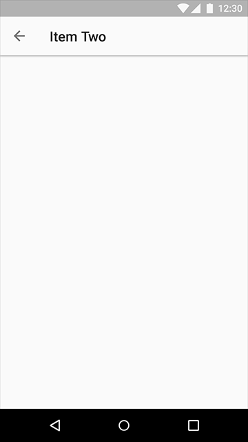

# 应用结构   

你的应用程序结构应该会受到你想展现给用户的内容和任务的影响。比如，你的应用程序可能：
- 专注于一个单一的活动（比如一个计算器或者游戏程序）
- 包含有限的导航（比如一个手机联系人拨号程序）
- 包含复杂数据视图和深度导航（比如一个含有文件夹的邮件应用程序）

> 启动页面

> 顶层导航策略

> 混合导航策略

## 启动页面   

启动页面是在人们开启你的应用时所看到的第一个页面，它对于新访客以及老访客来讲都必须是友好的。在构建这一模块的体验时要根据典型用户的需求来做。
- **突出显示内容**。将内容置于你启动页面的中心位置。使用视觉上动人并且有响应的布局。
- **锚导航和动作**。要考虑[应用条](https://www.google.com/design/spec/layout/structure.html#structure-app-bar)如何显示导航控制的问题，包括布置标签切换和检索框。
- **专注于功能**。突出显示那些重要的导航目标和不常用的导航目标。使用[浮动操作按钮](https://www.google.com/design/spec/components/buttons-floating-action-button.html)来触发主要的动作。

## 顶层导航策略   

顶层导航包含的是你应用中的主要功能。将你应用的导航与你页面的复杂度或简易度相匹配。

### 单页面的嵌入式导航   

简单结构的应用能够在内容中嵌入导航。然而，这样做会减少用于显示内容的空间。

推荐：
- 具有非常直观主界面的应用，同时很少有间隔
- 完整的通用任务
- 不常用的功能

### 标签   

[标签](https://www.google.com/design/spec/components/tabs.html)在少部分具有同等重要性的页面之间转化。这些标签可以增加那些具有较少功能或简单层级结构应用的顶层视图的认知度。由于标签占据了某一较小视图的重要位置，因此应该尽量使用短标签。

推荐：
- 频繁的视图转换
- 有限数量的顶层视图
- 提升对可切换视图的意识

### 手机   

对于那些只有一层导航的应用，基于文本的标签可以被贯穿用于整个顶层。

四分之三的水平标签具有推荐大小并通过使用短字符串来避免在小型设备上发生卷曲显示。

有两个标签的移动端实例

有三个标签的移动端实例

### 平板和桌面电脑   

屏幕尺寸、方位以及模块的数量决定了标签是否应该是：
- 全排或固定的
- 向左、中或右对齐

具有四节全排标签的平板

左对齐固定并包含标题和拓展题头标签的平板

具有中部固定标签的桌面电脑

### 侧面导航与导航抽屉   

使用边导航来达到一次性显示多导航目标的目的。它既可以显示也可以不显示导航抽屉。抽屉是一种实现内容从较低层级页面跳转的有效方式，并且它在用户请求之前一直保持隐藏状态。具有单一“主页”（home）的应用应该将那些访问最频繁的目的页面置于导航抽屉的最上部。

推荐：
- 具有许多高层级视图的应用
- 在不相关视图之间的快速导航
- 深度导航结构
- 减少不频繁访问目标导航的显示

### 手机与平板  

导航抽屉是默认被关闭的，只有在某一节被选中的时候才能临时开启。

一个关闭侧导航的移动端实例

一个开启侧导航的移动端实例

一个关闭侧导航的平板实例

一个开启侧导航的平板实例

### 桌面电脑   

导航可以直接出现在页面上，而不是在抽屉里。

一个侧导航的桌面电脑实例

## 混合导航策略   

### 文本内导航   

在使用标签或导航抽屉时，文本内导航可以使相关数据集合之间形成快速转换。

将它应用于：
- 将某一首歌链接到某一位歌手
- 在当前项目与某一完整历史之间的切换
- 将某一位用户的邮件与他（她）的个人信息页进行连接

向上箭头被用于返回前一层级

将导航与内容进行混合的一个移动端实例

一个向上箭头的移动端实例

在内容中嵌入导航的一个平板实例

一个向上箭头的平板实例

### 侧导航与标签的结合   

具有双层级导航的产品可能同时具有一个左侧导航抽屉和标签。

使用双层级导航的移动端实例：一个导航抽屉和标签

开启左侧导航的一个移动端实例

使用双层级导航的平板实例：一个导航抽屉和标签

在标签前开启左侧导航的一个平板实例

使用双层级导航的桌面实例：一个导航抽屉和标签
