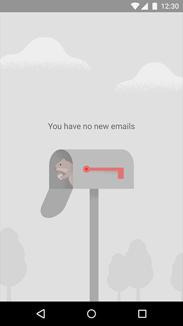
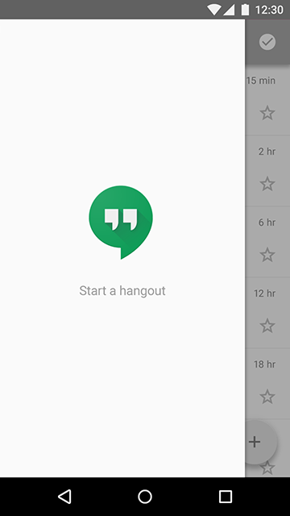
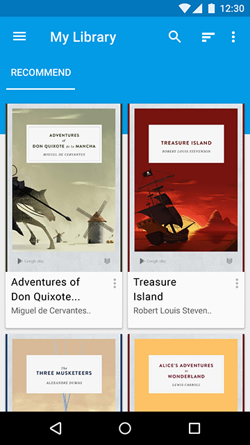
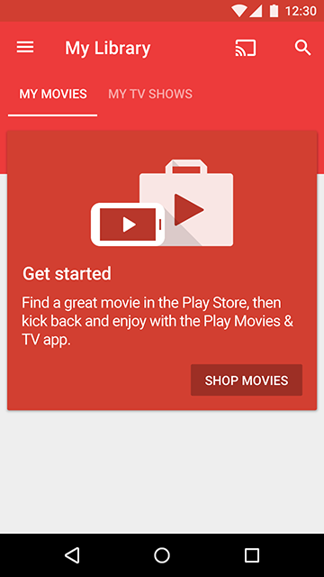
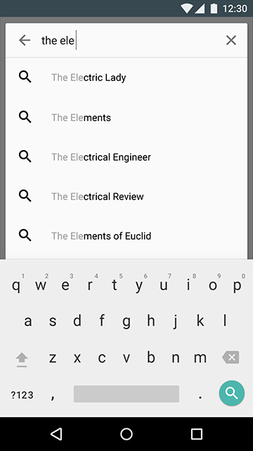
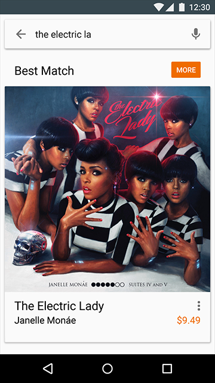

# 空状态   

空状态发生于一个常规内容页面不能显示时。可能是一个没有条目的列表，或者一个没有返回结果的搜索。虽然这些情况不是典型的，但也是展示良好设计以避免用户失望或者困惑的好机会。

如果因为一个系统错误不能显示内容，参见 [app errors](https://www.google.com/design/spec/patterns/errors.html#errors-app-errors)。

> 显示空状态

> 避免完全空的内容

## 显示空状态   

最基本的空状态显示一个非交互的图片和文本标语。

使用一个图片：
- 相对于背景来说，显得巧妙和素净。
- 以一个生动的方式传达应用的目的和意图，就像你的应用图标

包含一个标语：
- 有积极的语气
- 与你的品牌一致
- 传达应用的意图，而不需要可操作

   

 (上图)可取：图片素净并且明显是背景的一部分。标语传达了应用的意图，并且没有需要操作的意思。

   

 (上图)不可取：图片明亮并且标语像是需要操作，让用户以为可以点击或者将会开始一段闲逛。

## 避免完全空的内容   

有好几种情况，你可以提供给用户完全空的内容之外的选项。

### 启动内容页面   

让新用户学习和着迷于你的应用最有吸引力的方式是通过使用它的过程。考虑提供一个启动页面内容，会让用户立即开始探索你的应用。

建议：
- 使用具有广泛诉求的内容，显示最主要的功能。
- 给予用户删除或者替代这个内容的能力。
- 如果可能的话，为用户提供个性化的内容。

   

一个书本阅读应用可以提供一些免费流行的书籍，让用户立马开始探索应用。

### 指导内容   

如果页面的意图并不能够通过一个图片和一个标语传达，考虑使用指导内容来取代。

建议：
- 一旦有了内容，帮助用户理解他们可以做什么。
- 可以取消或者跳过内容。
- 保持简洁。

   

一个用户在一个电影应用里看视频之前，一个可以取消的卡片显示出来解释服务的特征和好处。

### 最佳匹配   

如果没有东西匹配用户的查询，是否存在一些稍微有点区别的查询词的结果？如果有，显示结果，因为它们可能会帮助用户找到想要的。

通过这个方法，在结果的顶部清楚地传达这个内容与真实查询结果的匹配，以确保不会被拼错。

   

   

提供“最佳匹配”是处理错拼查询的很好方法，而不至于让用户承担责任。

