# 错误    

错误是应用未按预期执行时出现的状况, 一般发生在:

* 应用无法识别用户输入的信息
* 系统或应用故障
* 用户执行的多个操作产生了冲突

用好的设计避免错误发生. 让你的应用理解用户, 而不是让用户去理解你的应用. 当错误不可避免的发生时, 向用户传达清晰的信息能更好地让用户理解发生了什么以及如何快速解决它. 随时随刻保存当前状态, 尤其是用户输入内容时.

在众多反馈信息中找到最重要的优先显示, 确保正确的信息传达到位而无关的元素不会出现在屏幕中, 并且它应该有一致的外观样式和固定的显示位置.

## 用户输入错误

在用户输入错误时给予内容提示帮助用户修正错误. 礼貌并及时地告诉用户他们犯了一个错误需要作出更正. 不要在用户提交了一个很长的表单后才告诉他们出现了一个错误. 而应该在检测到错误时禁用表单提交按钮. 如果错误只有在用户提交表单后才能被发现, 要清晰地指明什么地方出现了错误以及解决它需要用户做什么.

### 文本输入框

辅助提示可以在用户输入前, 输入时或输入之后任何时间显示. 但错误提示不要在用户与输入框交互之前出现. 辅助提示可以在用户输错了文本后转换成错误提示.

不要让太多的提示充斥屏幕以至于降低用户的效率. 不是每个文本框都需要辅助或错误提示.

如果在文本框下方展示错误提示, 那么该提示与其所指的出错文本框之间要留出 16dps 的间距.

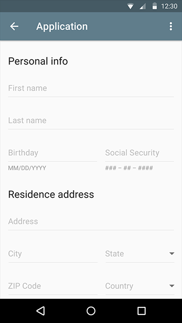

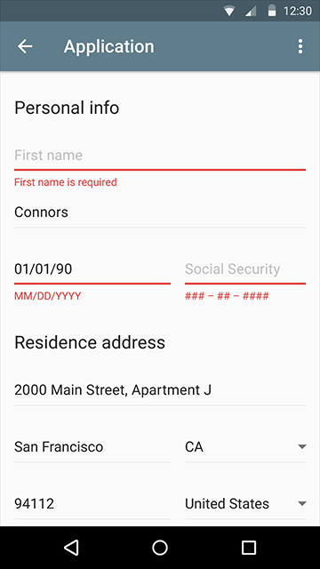

#### 浅色主题

错误提示字体使用 Roboto Regular 12sp
预置词 (Hint) 和提示字色使用 带有 38% 透明度的 #000000

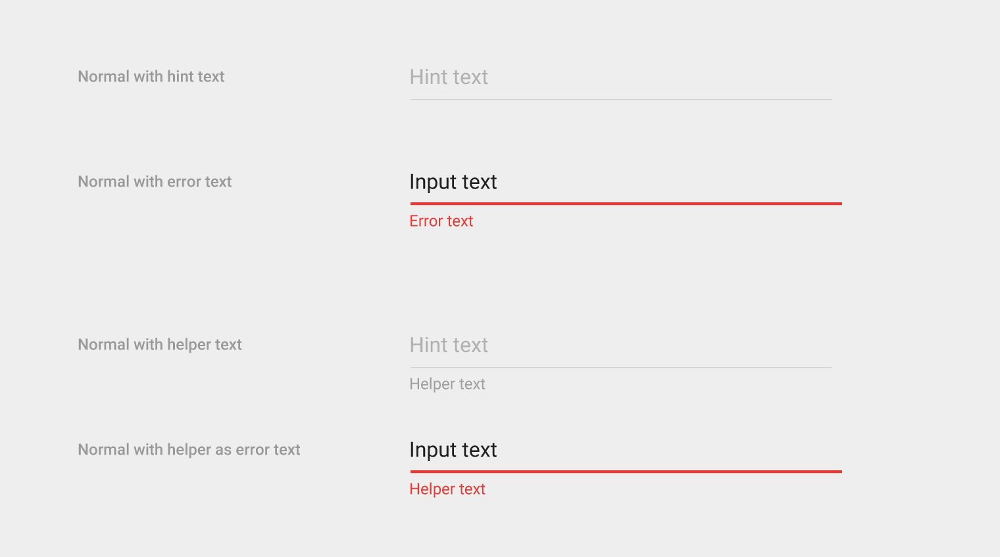

#### 深色主题

错误提示字体使用 Roboto Regular 12sp
预置词和提示字色使用 带有 30% 透明度的 #FFFFFF

#### 辅助和错误提示

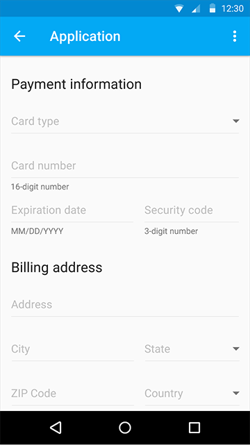

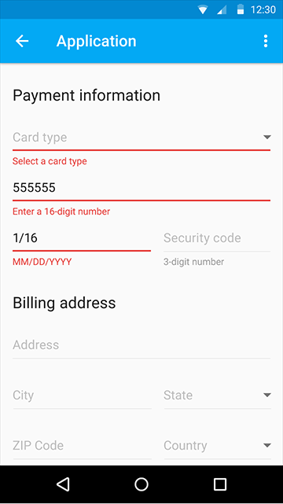

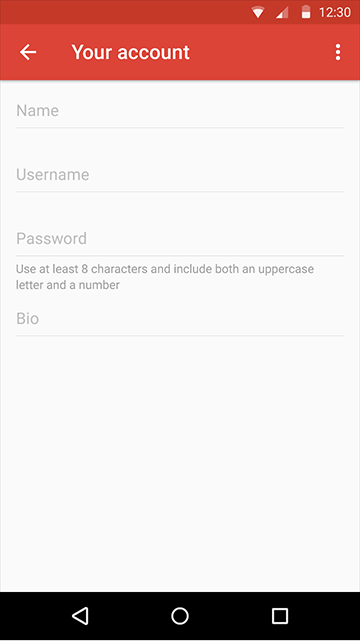

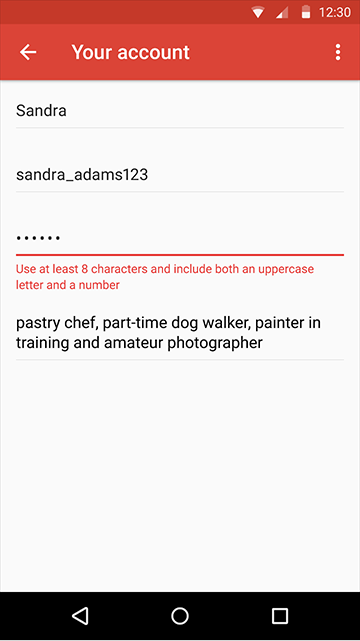

#### 错误提示与浮动文字标题

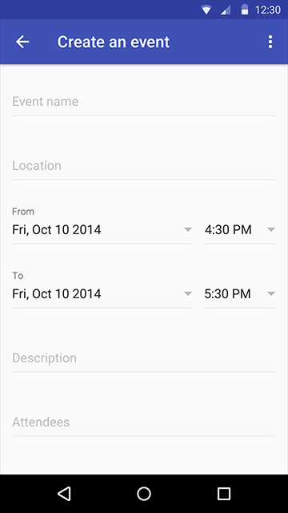

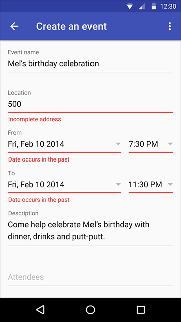

### 带字数统计的文本输入框   

计数器可以在用户输入前, 输入时或输入之后任何时间显示. 也可以考虑用户的输入接近上限时才显示计数器. 计数器与文本框之间要留出 16dps 的间距.

* 计数器的字体使用 Roboto Regular 12sp

#### 带字数统计的单行输入框

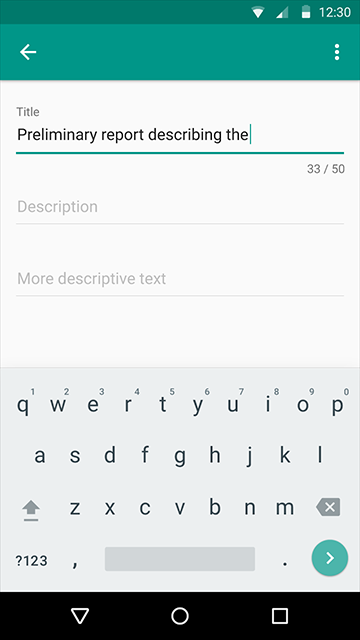

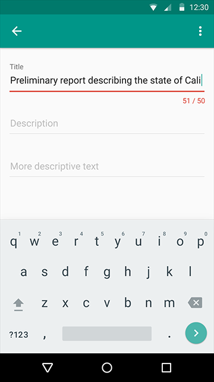

#### 带字数统计的多行输入框

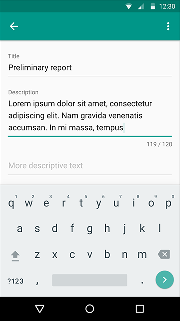

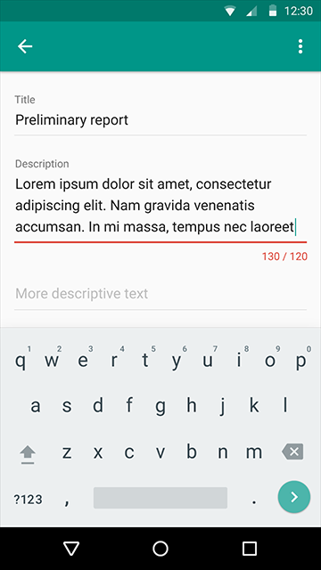

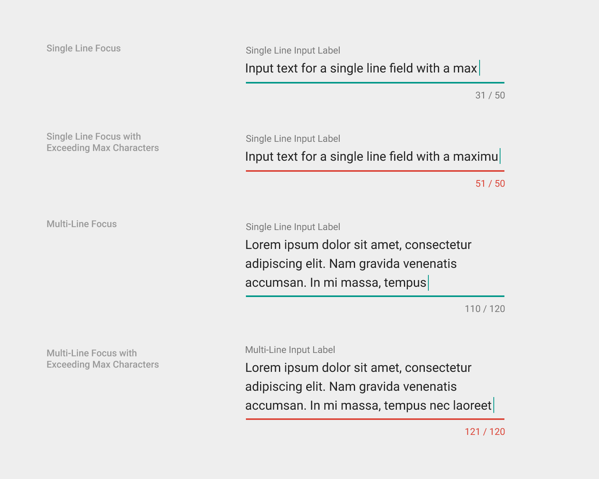

### 冲突值

冲突值错误是用户输入时或输入之后才会触发的错误.

如果有两个以上的输入框出现了冲突的输入, 除了每个输入框下方都有错误提示信息指示如何修正外, 还应该在屏幕顶端显示一条总结性的修正建议或附加说明.

#### 提交表单后检测到错误

表单应当被重新加载并且滚动到表单顶端, 这里会显示汇总的错误信息.
而各处独立的错误信息提示用户想要完成表单就先解决它们.

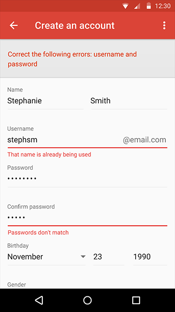

### 不完整的表单

如果用户在填写表单时遗漏了必填项, 那么不完整表单的错误信息会指示出他们遗漏了哪些输入项. 如果不能检测用户填写表单的进度, 那么应该在用户试图提交表单后显示错误提示.

如果表单中的多个输入框被留空, 每个输入框下都应该有错误信息指示此处不完整.

#### 提交表单后的多条错误信息

确保有足够的独立错误信息指示用户如何完成表单.

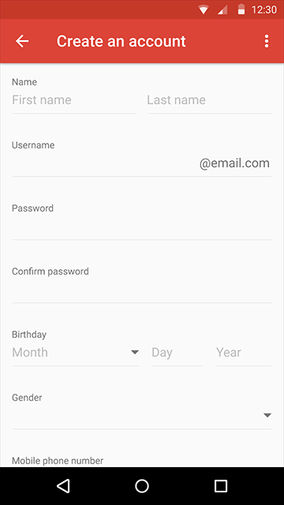

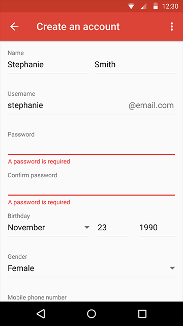

### 单行列表错误

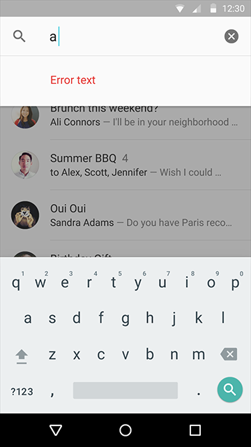

## 应用错误

应用错误无论用户是否输入都会发生.

### 一般应用错误   

如果应用某个进程中出现错误, 应该持续显示当前活动/加载指示器 (activity/loading indicators) 直到获取到失败的状态并将错误显示出来.

如果功能不可用, 应该在 UI 中表示出来. 但并不是每个错误都需要用弹出组件的方式告知.

如果可以的话, 给用户提出一个可以解决此错误的操作建议, 帮助他们摆脱困境.

错误对话框: 应用反馈了一个阻止程序正常运行的错误.

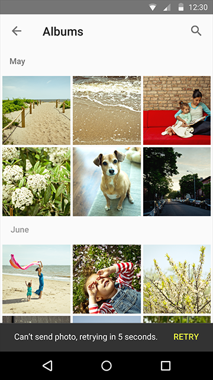

Snackbar: 应用反馈了一个无关紧要的错误. Snackbar 只能短暂显示, 不要用它反馈紧要的, 持续的或大批量的错误.

### 同步加载错误/失败

应用设计中很关键的一步是确认哪些屏用来呈现内容, 而其中又要考虑这些屏在虑预定的内容没能呈现时应该怎么做. 包括如下情况:

* 正常应该呈现一列列表, 但列表项是空的.
* 正常应该显示搜索结果, 但当前搜索结果数为零.
* 正常应该显示基于云端的内容 (cloud-based content), 但因为未知错误导致现在无法显示.

以上这些设想的情况被叫做空数据状态 (empty states). 虽然这方面没有标准规范, 但把它们设计好非常重要, 因为偶然出现的不在预期内的状况可能已经让你的用户彻底失望.

当同步停滞或内容加载失败时, 用户与应用其他部分交互尽可能不要受到影响.

屏幕/内容加载失败的空数据状态.

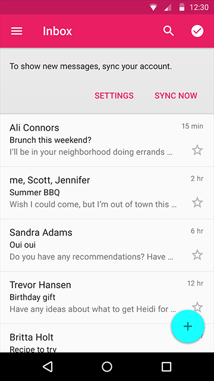

容器/组件特定的错误及建议操作.

### 联接

当联接 (Connectivity) 失效时, 用户与应用其他部分交互尽可能不要受到影响.

如果可以, 提供一个可以帮助他们完成任务的链接. 确保提供的链接确实可以提供帮助. 例如, 在可以预计到操作会失败的情况下, 就不要提供一个类似 "再试一次" 的操作.

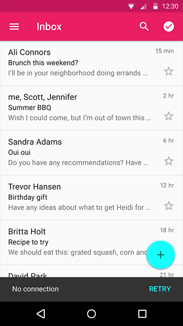

带有重试操作的 Snackbar.

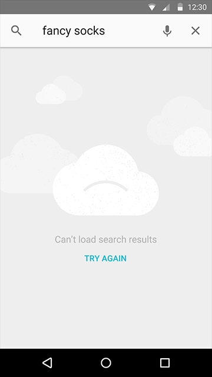

必须联网可见的屏的空数据状态.

## 冲突状态错误

冲突状态错误发生在用户试图运行的操作起冲突时, 例如在飞行模式下拨打电话或在访问受限的账户下截图操作. 尝试清晰地传达出此状态是用户自己所选的并暗示 (implications) 此种情况下体验有何不同, 避免让用户走进死胡同 (putt themselves into these situations). 当触发了这些错误时, 要避免暗示用户这是他们的错.

#### 一般冲突

要清晰地阐明为什么发生错误以及根源在哪.

例子:

* 截图以及其他高级功能 (premium features) 在受限模式 (restricted mode) 中无法使用.

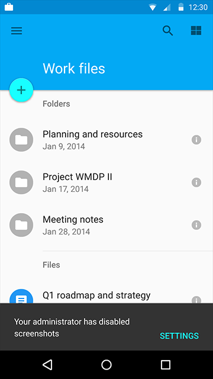

Snackbar + 特殊模式指示器

#### 用户选择离线

当用户处于这种状态下, 可以考虑使用不打扰，但持续显示的指示器.

例子:

* 在飞行模式拨打电话
* 离线状态下在线音乐不可用

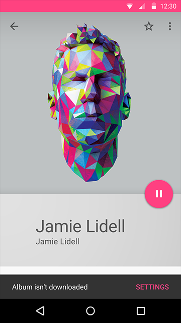

Snackbar

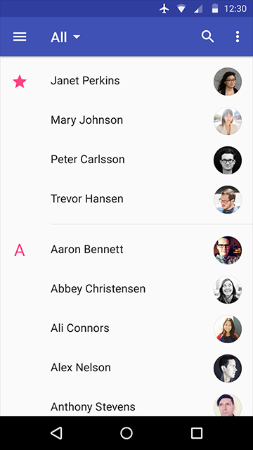

设备启用飞行模式时的指示器

#### 许可请求

如果应用必须获得用户准许后才继续某些流程, 考虑在流程中插入许可请求, 而不是把它当作一个错误处理.

如果必须在首次运行应用前获得许可, 要考虑是否可以把请求与欢迎信息结合起来.

例子:

* 应用的权限发生了改变.
* 应用内购 (In-app purchases) 被禁用 (disabled).

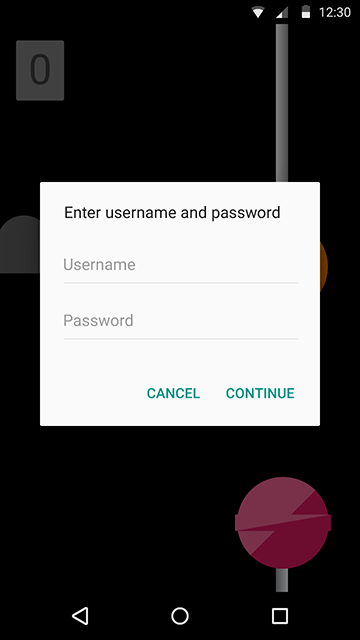

对话框

