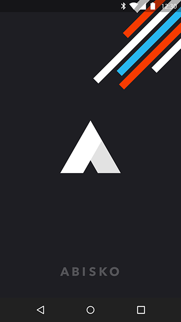
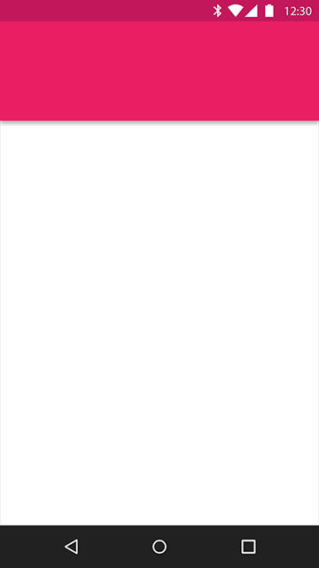
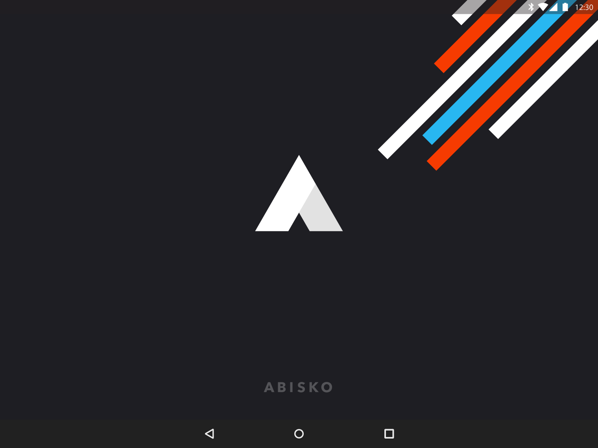
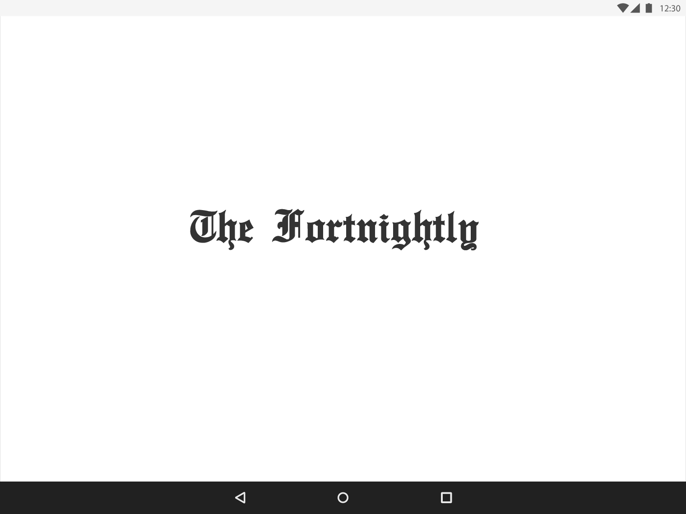

# 启动屏幕

启动屏幕是一个用户对你应用的第一体验。

> 启动页面类型

> 占位 UI

> 品牌启动页面

## 启动页面类型   

启动页面是用户对你应用的第一体验。

启动应用时，如果显示一个空白面板，会增加用户观察到的加载时间，考虑使用占位符 UI 或者一个品牌加载页面。

`占位 UI` 是最无缝的加载转换——适用于应用加载和应用内活动切换两者。

`品牌启动页面`提供了短暂的品牌曝光，让 UI 聚焦于内容上面。

    

品牌启动页面

   

占位 UI

## 占位 UI   

对于拥有非常短的加载时间的应用，或者没有太强的品牌需求，占位 UI 拥有最少可能的转换以及最好的视觉效果。

启动时，核心结构元素例如状态条，应用条，以及底部页不带内容显示，直到应用加载。

## 品牌启动页面   

品牌启动页面是加载一个应用时塑造品牌的好方法。利用加载时间来显示你的商标或者其他提升品牌认知度的元素。避免在页面上使用商标之外的文本，如果可用的话，标语。

#### 品牌启动页面   

启动页面应该被用做从主页面触发的初始化冷启动，并且不应该出现于应用运行中，或者从其他应用切换过来。

