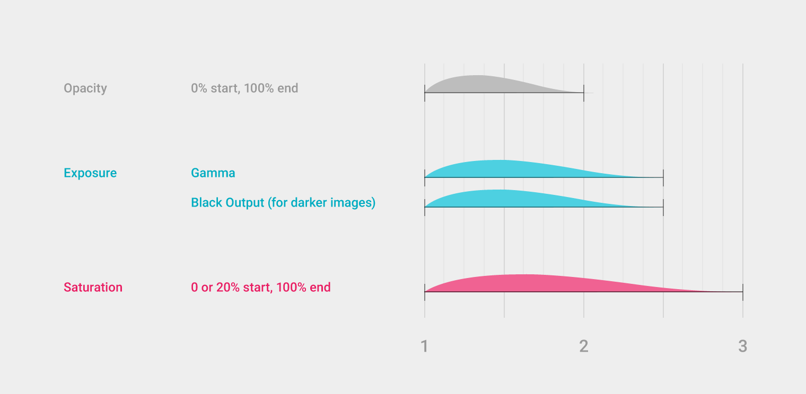
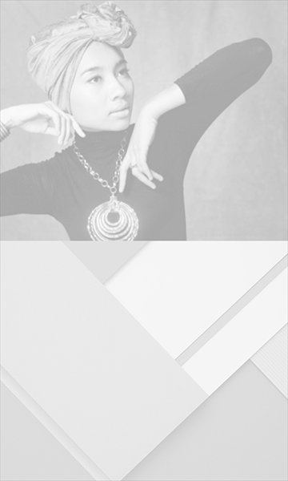
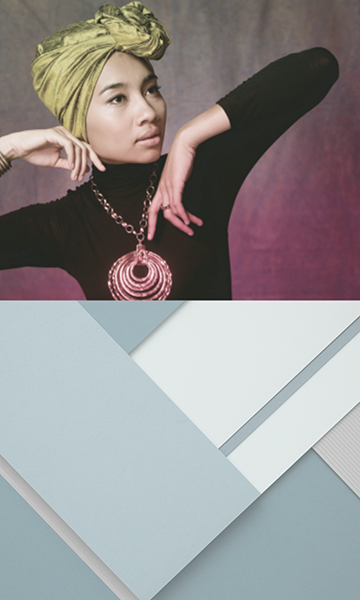
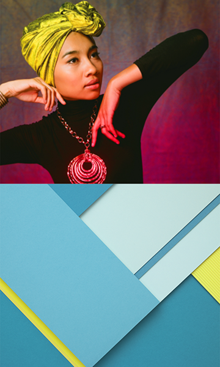
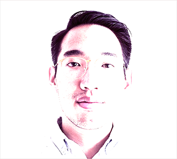

# 加载图片

> 加载图片

## 加载图片   

插图和照片可以在排列时以三种相位进行加载和转换，而不仅仅依赖于透明度转换。结合透明度、曝光度以及饱和度变化来满足你的需求。

曝光度为低对比度以及低饱和度进行调整。一旦透明度达到 100%，会达到全色饱和度。

低对比效果结合 gamma 和 black output（专为黑色图片）的转换。

**加载图片时的透明度、曝光度以及饱和度建议**

透明度：0% 开始，100% 结束

曝光度：Gamma，Black output（专为黑色图片）

饱和度: 0 或者 20% 开始, 100% 结束

低透明度以及低对比度

完全透明和曝光

颜色饱和度

### 逐渐增强过程   

目睹图片逐渐增强，就像照片的冲洗过程一样。

注意不要让图片过度曝光。

 (上图)可取

 (上图)不可取

### 持续时间   

加载图片时推荐长一点的持续时间，过渡时推荐短一点的持续时间。

<video crossorigin="anonymous"  loop  controls width="760" height="350">
<source src="http://materialdesign.qiniudn.com/videos/patterns-imagerytreatment-imageload-transition_large_xhdpi.mp4">
</video>

加载和过渡动画

### 大一点的屏幕   

这个过程对于大一点的屏幕比较理想，例如加载 Chrome OS 的墙纸。

<video crossorigin="anonymous"  loop  controls width="760" height="350">
<source src="http://materialdesign.qiniudn.com/videos/patterns_loadingimages_largescreen.mp4">
</video>

动画显示了在大一点的屏幕上加载 Chrome OS 墙纸。

### 添加动画   

给正在加载的图片一个小的位移。这里账户切换中的背景图片水平移动。

<video crossorigin="anonymous"  loop  controls width="760" height="350">
<source src="http://materialdesign.qiniudn.com/videos/patterns-loadingimages-loading-070901_Load_Add_Animation_xhdpi_002.mp4">
</video>

显示添加移动的视频。
