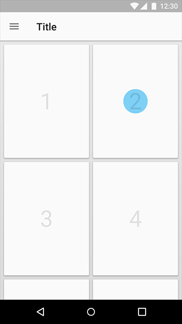
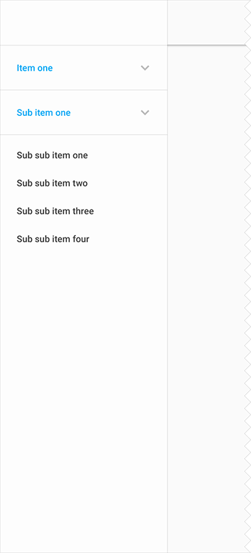
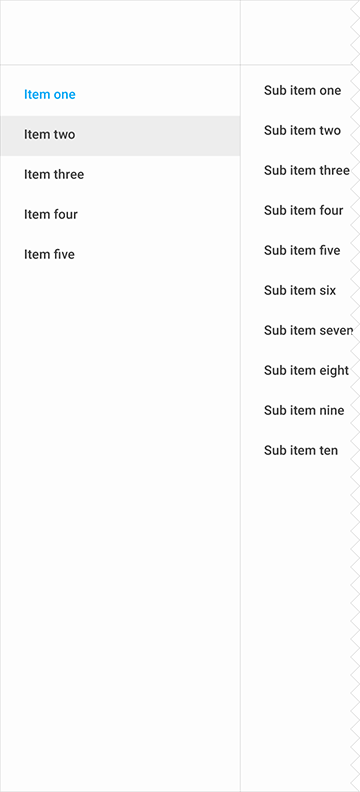

# 导航   

> 层级一
> 层级二
> 三层级或者更多

## 层级一   

### 标签   

只有单层导航的产品可以在顶层使用基于文本的标签。

为了避免滚动，设置一个三到四的水平标签最大值。

带有两个标签菜单的手机示例

带有三个标签菜单的手机示例

平板上，标签宽度和对齐方式由屏幕尺寸、方向以及菜单数量决定。标签可以全排也可以固定，可以居左、居中或者居右。

查看[标签](https://www.google.com/design/spec/components/tabs.html)以获取更多信息。

平板上的带有四个段落的全排标签示例

平板上的带有标题和扩展头部的居左对齐固定标签的示例

居中固定标签的桌面示例

导航抽屉

导航抽屉可以被用作导航。默认关闭，只在一个段落被选中时暂时打开。

查看 [UI Regions and Guidance](https://www.google.com/design/spec/layout/structure.html#structure-ui-regions) 获取关于顶层导航策略的更多信息。   

关闭状态侧边导航的手机示例

打开状态侧边导航的手机示例

关闭状态侧边导航的平板示例

关闭状态侧边导航的平板示例

侧边导航的桌面示例

## 层级二   

### 导航抽屉以及标签   

如果你的产品有两层导航，让左边的导航抽屉带有标签。

在手机和平板上，导航抽屉只支持单层级别的导航。

手机使用导航抽屉以及标签的两层示例

带有打开侧边导航的手机示例

平板上使用导航抽屉以及标签的两层级示例

带有打开侧边导航的平板示例

桌面上使用导航抽屉以及标签的两层级示例

### 导航抽屉   

桌面上，二层导航可以被嵌套在导航抽屉里。

一个嵌套侧边导航的桌面示例

## 三层级或者更多   

### 导航内容   

如果你的产品有多层级的导航，导航抽屉应该包含导航的主要层级。

### 手机和平板   

顺序导航层级可以被融合到内容里，链接到单个页面。向上箭头被用作回到上层菜单。

手机上的集成到内容中的导航示例

手机上的向上箭头示例

平板上的集成到内容中的导航示例

平板上的向上箭头示例

### 嵌套导航抽屉以及标签（桌面）   

如果你的产品有三层导航，使用嵌套导航抽屉和 tabs 两者。

桌面上带有标签的嵌套侧边导航示例

### 扩展导航抽屉（桌面）   

如果你的产品拥有三层以上的导航，可以在导航抽屉中使用一个可伸展的层次结构。被选中时，当前层级收缩起来，展现下一层级的导航。点击一个收缩起来的菜单，会在导航抽屉中伸展当前层级，并把其他层级都收缩起来。

桌面上一个伸展侧边导航的示例

三层深度内容的侧边导航

### 级联导航抽屉（桌面）   

如果你的产品有不止三层导航，可以使用级联菜单来垂直伸展导航抽屉内容。每个层级在自己的面板中显示，当一个子菜单被选中时，当前层级关闭。

级联侧边导航的桌面示例

