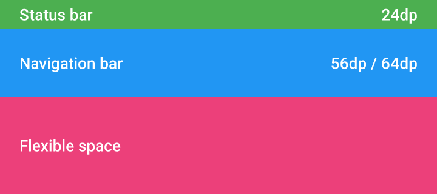

# 滚动时的技巧

## 滚动

### 基于模块化

设计滚动的动作的时候建议用模块去思考，但只是一种思考模型而不适合用视觉的形式去表达。

设计滚动动作时主要用到四个应用程序栏
下面就是应用程序栏实现滚动时的四个模块

* 状态栏:24dp
* 导航栏：在手机上为 56dp ，在平板电脑和台式机上使用 64dp  
* 标签栏/搜索栏：48dp
* 适应所需的纵横比 

弹性区域：为了给扩展的应用程序栏或图片提供调节纵横比的区域    

为了适应应用程序栏伸缩时的所需的纵横比

 
 

## 标准的应用程序栏

标准的应用程序栏在手机端的高度为 56dp，在更大尺寸的屏幕上是 64dp
这里有两种不同的方式来实现滚动
 
1.应用程序栏可以随着内容的滚动褪出屏幕也可以在反向滚动时恢复原态

2.应用程序栏可以在它下面的内容滚动的时候在顶部保持不变

 

## 标签

标准应用程序栏可以被扩大到容纳标签或一个搜索框。使用模块化的工作模式对实现滚动很有益
你有两种实现方式：   

1.导航栏在滚动出屏幕的时候标签栏在顶部保持不动

2.应用程序栏保持不动，下面的内容滚动

 

## 弹性区域

应用程序栏为了能够适应较大的排版或图片而具有弹性，添加了一个弹性区域

1.弹性区域可以收缩到只剩下导航栏。标题也会在导航菜单里收缩到只剩下 20sp
当反向滚动的时候，弹性区域和标题栏又恢复原样了

2.整个的应用程序栏都褪出屏幕。当用户反向滚动的时候，导航栏又返回到了顶部
当反向滚动到顶部的时候，弹性区域和标题也恢复原来位置了

 

## 弹性区域中的图片
 
在应用程序栏中使用图片时，可以用弹性区域来调节所需的纵横比。在这个例子中，纵横比是4：3。当滚动时，图片被内容推到上方使弹性空间缩小了。剩余的 20% 的图片的弹性空间会被程序原本的颜色渲染

 

> 原文：[Settings](http://www.google.com/design/spec/patterns/scrolling-techniques.html#)  翻译：[aprildove](https://github.com/aprildove)   
