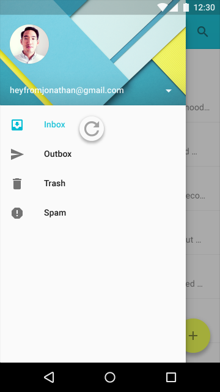
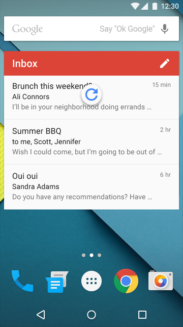
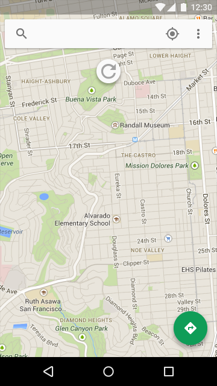
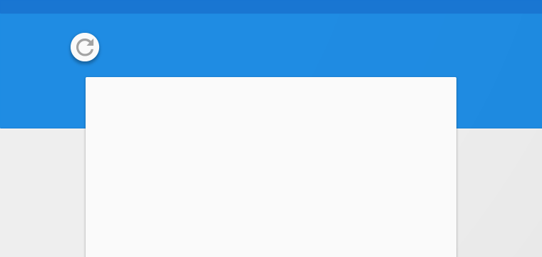
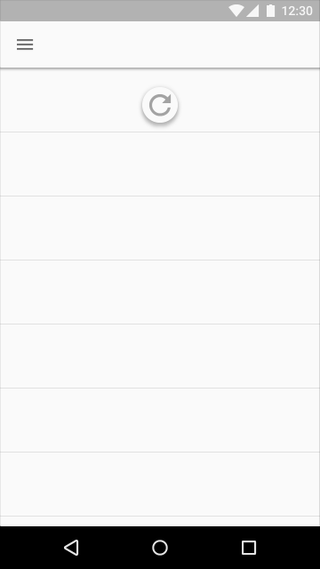
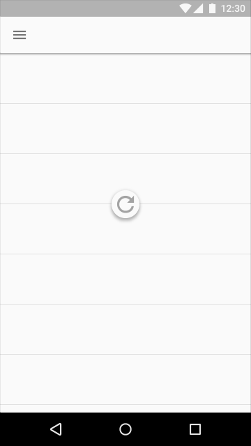

# 滑动刷新

## 更新内容

在应用里有两种更新内容的方法。较好的方法是用[sync](http://developer.android.com/training/sync-adapters/index.html)自动更新内容。Syncing 能保持内容自动更新，因为它不需要用户操作。

另外一种，手动刷新需要用户通过动作或者手势启动内容更新。手动刷新提供同步的同时保持当前的滚动位置。例如在Gmail里检查新邮件。

## 滑动刷新

滑动刷新是一个[滑动手势](http://www.google.com/design/spec/patterns/gestures.html#gestures-gestures)。可用在普通列表，方格列表的开始处和卡片集合的最近内容出现的位置（Index 0）。

位置：

典型的，手势在内容集合的顶部使用。但是它也可以在底部使用（例如，在聊天应用）。

用法：

刷新图标仅仅与刷新手势或者动作一起出现。Syncing不显示刷新图标。手势最要用在动态内容在固定的位置，并且频繁更新的情况。固定的位置也是用户用手势刷新后最可能关注的位置。

当手势用在刷新后视图会显著改变的情况下，变化可能不是立即明显有效。

> [滑动刷新布局](https://developer.android.com/reference/android/support/v4/widget/SwipeRefreshLayout.html)  
> 通过一个垂直方向的滑动手势刷新视图的内容。

<video crossorigin="anonymous"  loop  controls width="360" height="640">
<source src="http://materialdesign.qiniudn.com/publish/material_v_4/material_ext_publish/0B6Okdz75tqQsRWlsOUFOeG96RnM/components-progressactivity-behavior_Loading_SwipeDown_noload_xhdpi_005.webm">
</video>

动画，显示滑动刷新

滑动刷新不应该用在以下的情景：
* 抽屉式的导航栏
* 主屏幕小插件
* Pannable内容

  

 ⬆️错误

抽屉式导航栏（如果在应用中存在）包括导航选项，不是动态内容。

  

 ⬆️错误

主屏幕小插件应该自动更新内容。

  

 ⬆️错误

Pannable内容，像地图，没有一个主要的方向或者内容起点，用户能认做滑动刷新的起点。

### 刷新图标位置和行为

位置：

刷新图标，当下拉停止时，在刷新内容的垂直正中间位置。

   

 ⬆️正确

  

 ⬆️错误

 ⬆️错误

刷新图标位置靠近刷新内容的顶部

准确的垂直下拉停止位置可以被调节以促使和下来的布局和谐。例如，图标可以落在材质边缘或者网格线上，只要它位于刷新内容的顶部。

    

 ⬆️正确

   

 ⬆️错误

行为：

刷新图标过渡进视图，圆形 spinner 逐渐增强同时旋转。

刷新图标保持可见，直到刷新活动完成，并且任何新内容是可见的，或者用户从刷新内容导航出去。

<video crossorigin="anonymous"  loop  controls width="360" height="640">
<source src="http://materialdesign.qiniudn.com/publish/material_v_4/material_ext_publish/0B6Okdz75tqQsUkpNWUx6NFI4clE/patterns-swipetorefresh-behavior_do_xhdpi_009.webm">
</video>

 ⬆️正确

保持刷新图标在视图上直到活动完成，并且反馈刷新后的状态。

<video crossorigin="anonymous"  loop  controls width="360" height="640">
<source src="http://materialdesign.qiniudn.com/publish/material_v_4/material_ext_publish/0B6Okdz75tqQsQ295RkQ0ZWFzMms/patterns-swipetorefresh-behavior_dont_xhdpi_009.webm">
</video>   

 ⬆️错误

滑动刷新图标离开屏幕隐藏刷新活动的状态并且可能意味着刷新活动和视图内一个特定的相关连，如一个卡片而不是整个视图。

## 刷新图标过渡

当另一个界面是在内容的 material 的前面（在 z-space），刷新图标从界面底下过渡，并且被夹住直到全部可见。

以下情况刷新图标增加大小作为过渡：

* 刷新 material 是在所有其他界面的前面（在z-space）
* 内容刷新开始从 app bar 或者菜单扩展操作。

<video crossorigin="anonymous"  loop  controls width="360" height="171">
<source src="http://materialdesign.qiniudn.compublish/material_v_4/material_ext_publish/0B6Okdz75tqQsTXlhUU5FT2JzX0U/patterns-swipetorefresh-zspace_refresh_xhdpi_007.webm">
</video>

刷新内容是在所有其他界面之上，在 z－space 空间。  

<video crossorigin="anonymous"  loop  controls width="360" height="640">
<source src="http://materialdesign.qiniudn.com/publish/material_v_4/material_ext_publish/0B6Okdz75tqQsZHZ1OUJOUFR1ZmM/patterns-swipetorefresh-coplanar_refresh_xhdpi_008.webm">
</video>

刷新内容是另一个界面在同一个面上。   

<video crossorigin="anonymous"  loop  controls width="360" height="640">
<source src="http://materialdesign.qiniudn.com/publish/material_v_4/material_ext_publish/0B6Okdz75tqQsVU56bGR1cjZMU1k/patterns-swipetorefresh-zspace_refresh_mobile_xhdpi_002.webm">
</video>

刷新内容是在z－space里另一个界面之下。   

<video crossorigin="anonymous"  loop  controls width="360" height="640">
<source src="http://materialdesign.qiniudn.com/publish/material_v_4/material_ext_publish/0B6Okdz75tqQsaDZOV1NmRlBVZjQ/patterns_swipetorefresh-appbar_refresh_xhdpi_007.webm">
</video>

刷新内容通过 app bar 操作。

### 实现细节

确保滑动刷新手势的有意使用，在应用开始将要开始刷新之前，刷新图标必须通过一个阈值。这个阈值是通过一些状态表示：

* 圆圈旋转控件 100% 不透明
* 圆圈控件旋转变慢
* 刷新图标的过渡速率变慢

完成手势只要任何一条达到阈值，并且启动刷新操作。

相反的手势通过阈值将取消刷新操作。

> 原文：[Swipe to refresh](http://www.google.com/design/spec/patterns/swipe-to-refresh.html)  翻译：[awong1900](https://github.com/awong1900)  校对：