# 字体排版（Typography）

## Roboto

自从 Ice Cream Sandwich 发布以来，Roboto 都是 Android 系统的默认字体集。在这个版本中，将 Roboto 做了进一步全面优化，以适配更多平台。宽度和圆度都轻微提高，从而提升了清晰度，并且看起来更加愉悦。  

  

[Roboto字体 - 1.21 MB(.zip)](http://materialdesign.qiniudn.com/downloads/RobotoTTF.zip)    

## 标准样式（Standard Styles）

### 字体排版的缩放和基本样式（Typographic Scale & Basic Styles）

同时使用过多的字体尺寸和样式可以很轻易的毁掉布局。字体排版的缩放是包含了有限个字体尺寸的集合，并且他们能够良好的适应布局结构。最基本的样式集合就是基于 12、14、16、20 和 34 号的字体排版缩放。

这些尺寸和样式在经典应用场合中让内容密度和阅读舒适度取得平衡。字体尺寸是通过 SP（可缩放像素数，scaleable pixels）指定的，让大尺寸字体获得更好的[可接受度](../usability/accessibility.md)。

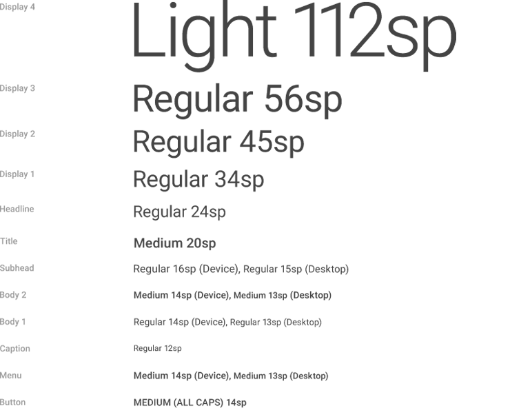  

  

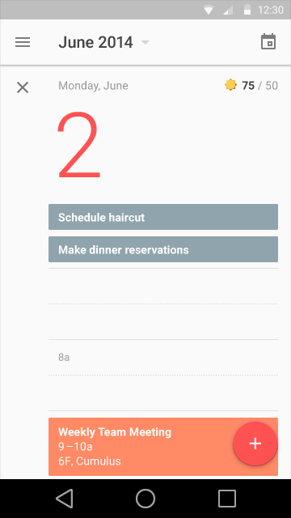   

“显示（Display）”样式的例子

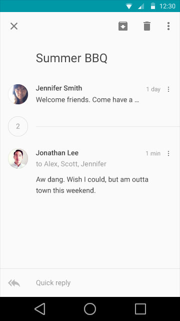   

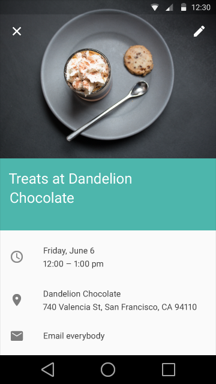   

“头条（Headline）”样式的例子

就任何表格元素来讲，App Bar 中出现的所有标题都要使用“标题”样式。

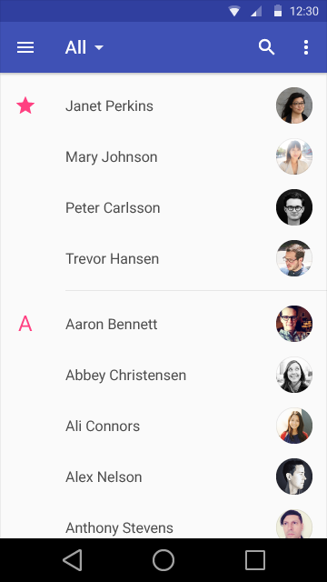  

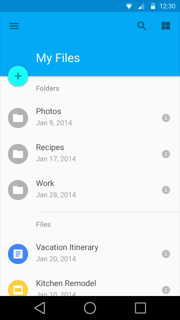   

“标题（Title）”样式的例子

在某些特定场合中，要使用“次要标题”样式，而不用较小的“主体”样式。这些个体包含了一小段文字预览，或者有标题与一行“主体”样式的文字一同出现。

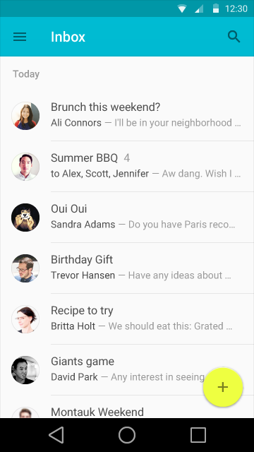  

   

“次要标题（Subhead）”样式的例子

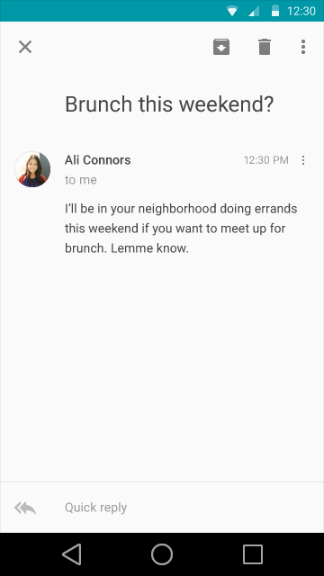   

   

“主体（Body）”样式的例子

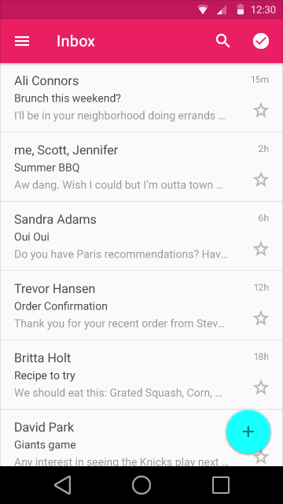  

   

“主体（Body）”样式的例子

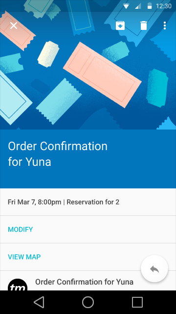  

   

“按钮（Button）”样式的例子

### 基本色/色彩对比度（Basic colors/Color contrast）

最基本的常识是，相同颜色的背景和文字是很难阅读的。但有些人不知道的是，带有过强对比度的文本会有些炫目，同样难以阅读。这一点在深色背景下尤其明显。

要获得良好的辨识度，文本应当满足一个最低的对比度，也就是 4.5:1（依据明度计算）。7:1 的对比度是最适合阅读的。

这些色彩的组合同样要考虑到某些非典型用户对于对比度的不同反应。

  

  

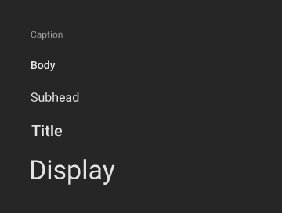   

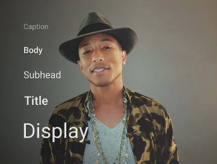   

  

### 大号字/动态字体尺寸（Big Type / Dynamic Type sizes）

如果使用得当，大号字会让应用显得更加有趣、容易辨别布局，并帮助用户快速理解内容。

动态字体尺寸让大号字可以在文本长度未知的情况下保持在容器之内。动态尺寸是根据可用空间和预估的字符空间，从字体排版缩放中选择的。

避免轻率地的使用小号字来适配较小的容器，除非万不得已。

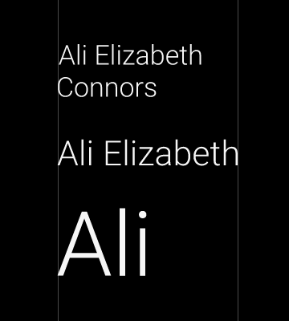  

   
样例对比   

   

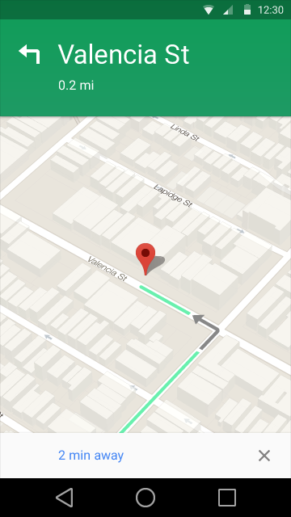   

### 行高（Line Height）

行高是通过每个样式各自的尺寸和粗细决定的，以获得良好的可读性和合适的间距。只有“主体”、“次要标题”、“大纲”等类似的样式中才允许使用自动换行。其它所有样式应当以单行形式出现。

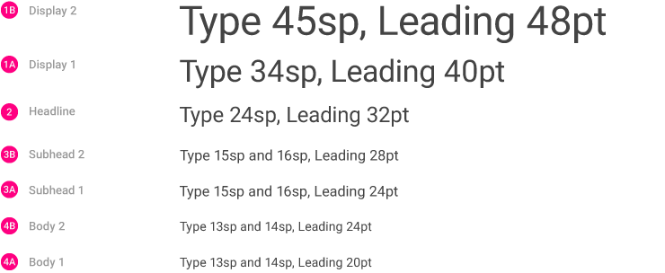   
样例对比   

   

    

### 换行规则/连字符（Line breaking rules / Hypenation）

     

 ⬆️正确
 

|   

 ⬆️错误

### 每行长度包含的字符（Characters per line lengths）

可读性和行长度参考了来自 Baymard Institute 的建议：

“要得到良好的阅读效果，每行应当包含 60 个字符左右。每行所包含的字符数量是决定阅读舒适度的关键因素。”

“过宽：如果每行文本过多，用户的眼睛将难以找到在文本上对焦。这是因为过长的文字导致用户难以判断一行的起始点，甚至在大段文字中出现读错行的现象。”

“过窄：如果每行文本过少，会导致眼睛来回扫视过于频繁，破坏阅读的节奏。过短的内容还会给人压力，导致用户完成本行阅读前过早跳转到下一行阅读（因此会错过潜在的重要信息）。”

参考: [可读性: 最佳行长度](http://baymard.com/blog/line-length-readability)
 
### 字间距（Tracking and kerning）

   

> 原文：[Typography](http://www.google.com/design/spec/style/typography.html) 翻译：[acely](https://github.com/acely) 校对：[chenyusi](https://github.com/chenyusi) 
