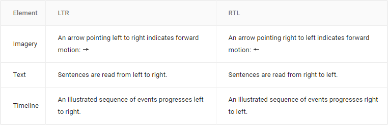
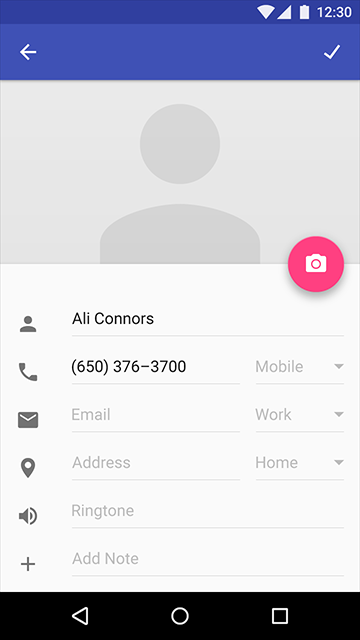
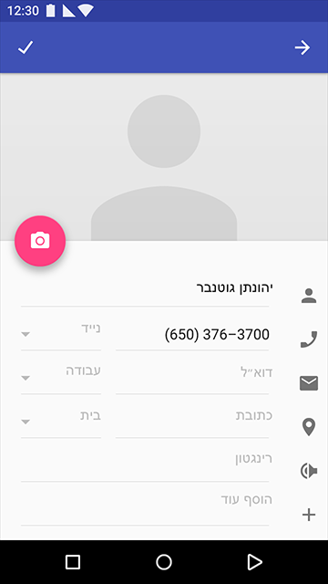
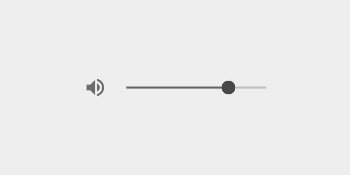
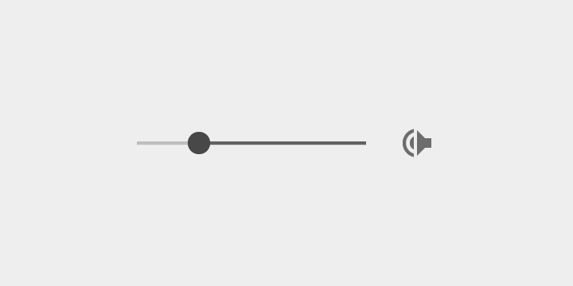
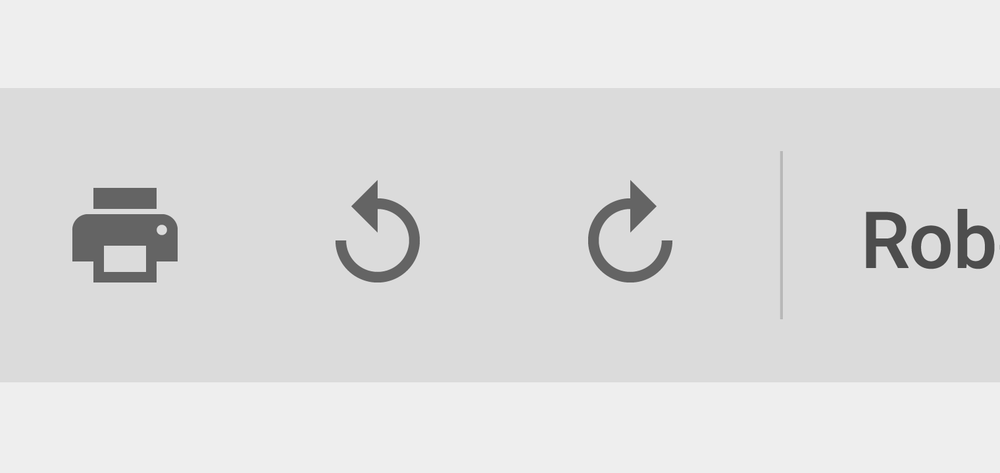
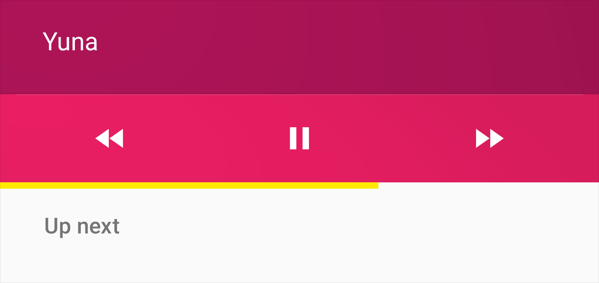
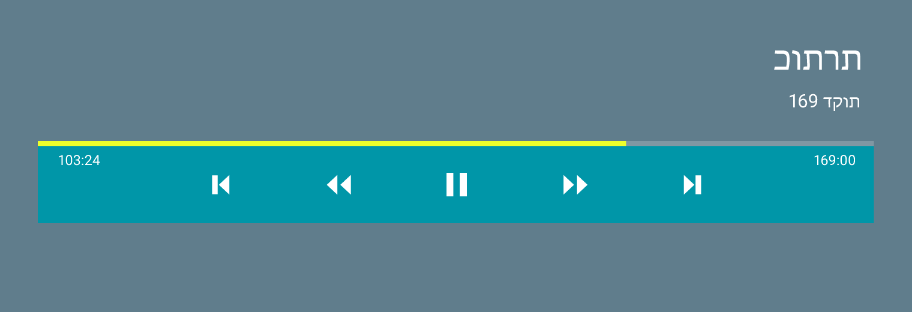
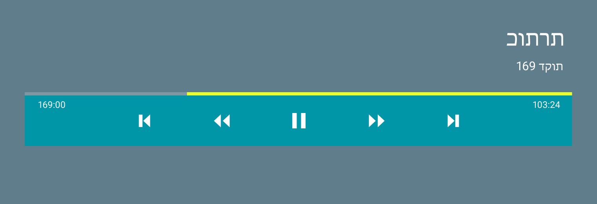

# 双向性   

一个良好设计的应用可以很容易本地化，只要使用例如英语从左到右读写的语言脚本，或者双向语言脚本。

在双向脚本中，文本从右到左写和读，除了数字和来自 LTR 语言的词汇，例如非本地化的名称，是从左到右写的。双向脚本包括 Arabic，Hebrew 和 Persian。

双向性不仅影响文本布局和 UI 元素，还影响图标图表。本节提供关于如何在设计中考虑双向性的基本高级信息。

> UI 镜像概览

> 从右到左（RTL）镜像指南

> 其他本地化考虑

## UI 镜像概览   

从左到右（LTR） 界面和从右到左（RTL）界面的主要区别在于时间的流逝如何计算。使用从左到右（LTR）脚本的语言从左到右描绘时间，使用从右到左（RTL）脚本的语言从右到左描绘时间。

镜像指把 UI 由从左到右（LTR）切换成从右到左（RTL）（反之亦然），影响应用布局和图形元素两者。注意，文本字符串、数字和来自从左到右（LTR）脚本的嵌入词汇不会被镜像；他们仍然是从左到右（LTR）。（文本字符串内容永远不会被镜像；在语言中总是正确的方向。）

从右到左（RTL）布局是从左到右（LTR）布局的镜像。

主要布局变化：
- 图标在文本框的右边。
- 导航按钮是反向顺序。
- 指示方向的图标，例如扬声器图标，被镜像。
- 不指示方向的图标，例如照相机和复选标记，不会被镜像。
- 文本被镜像，但是时间和电话号码不会。从右到左（RTL）脚本中数字从左到右（LTR）显示。

   

使用从左到右（LTR）UI 的例子

   

Hebrew 中使用从右到左（RTL）的例子。数字从左到右（LTR）显示。

## 从右到左（RTL）镜像指南   

镜像文本、布局以及图标图表时，遵循这些指南，支持从右到左的 UI。

从右到左（RTL）界面的指导准则是时间从右到左。前进指向左，后退指向右。

镜像时最重要的图标是前进和后退按钮。

### 何时镜像   

后退和前进导航按钮被翻转。

    

从左到右（LTR）后退按钮

   
从右到左（RTL）后退按钮

   
从左到右（LTR）前进按钮

   
从右到左（RTL）前进按钮

一个指示前进动作的图标应该被镜像。

   
一个从左到右（LTR）的自行车前进指向右边。

   
一个从右到左（RTL）自行车前进指向左边。

其他东西更加微小。例如，一个代表设置的图标使用一个斜线穿过图标来表明不可用状态。在一个从左到右（LTR）界面中，斜线从左上到右下。在一个从右到左的界面中，斜线从右上到左下。

   
一个从左到右（LTR）飞行模式的离线状态。

   
一个从右到左（RTL）飞机模式的离线状态。

图片中，斜线被镜像。飞机本身直指向上。不需要特别对待。

右边有一个滑块的音量图标应该被镜像。滑块应该从右到左（RTL）进行，声波应该从右边出现。

   
带有滑块的从左到右（LTR）音量

   
带有扬声器图标和滑块的从从右到左的音量被镜像

人形图标，头部和脸部应该被特别镜像，尤其是如果他们显得靠近文本。这是人形如何正向面向文本，而不是反向背对文本。

这有时可能是非常细微的，处理一个带角度的或者轻微扭转的人脸，或者一组人脸。

   
从左到右（LTR）群组图标

   
从右到左（RTL）群组图标

有时，时间的水平和环形方向都在图标中有指示。例如，谷歌文档中的重做和取消重做按钮既有水平方向又有圆形方向。

在从左到右（LTR）设计中，时间的圆形和水平表示都指向同一个方向。在从右到左（RTL）设计中，选择是否要显示圆形或者水平方向。

   

谷歌文档中的从左到右（LTR）重做（redo）和撤销重做（undo）按钮。

含有文本代表的图标需要特别的镜像。

在从右到左（RTL）设计中，文本是居右对齐的。如果段落的开头有缩进，段落结尾有未完成的行或者右边不对齐，这些情况图标都需要被镜像。

   

从左到右（LTR）聊天图标

   

从右到左（RTL）聊天图标

### 何时不要镜像   

当时间的线性表示在从右到左（RTL）中被镜像，圆形的方向不需要被镜像。从右到左（RTL）语言中时钟仍然是顺时针旋转的。一个带有顺时针指向箭头的钟表图标、圆形刷新以及进度指示不需要被镜像。

   

显示时间前进的刷新按钮；方向是顺时针的。图标不被镜像。

   

历史图标指向时间的反方向；方式是逆时针的。图标不被镜像。

一些代表实体物体的图标在从右到左的设计中不被镜像。

例如，物理键盘在现实时间中到处一样，所以不被镜像。

   

键盘图标

   

耳机图标

看起来带有方向，但是事实上代表用右手握住一个实体的特定图标。

例如，搜索图标典型的是把手柄放在右侧底部，因为大部分用户是右撇子。

从右到左（RTL）世界中的大部分也是右撇子，所以这样的图标不应该被镜像。

   

搜索图标

   

咖啡杯图标

媒体回放按钮以及进度指示不被镜像。这些元素的从左到右（LTR）方向代表磁带的方向，不是时间的方向。

   

既然媒体回放按钮以及进度指示反应磁带的方向，他们不被镜像。

   

多媒体的回放控制永远是从左到右（LTR）的。

   

不要镜像多媒体回放按钮或者进度条。这些元素的方向代表磁带的方向，不是时间的方向。

## 其他本地化考虑   

### 图形中的文本   

由于图形元素中的文本总是需要本地化，最好用不使用文本的方式传达理念。

### 数字   

数字也是文本。包含数字的图标也需要为使用不同数字的语言进行本地化。例如，Bengali，Marathi，Nepali，以及大部分阿拉伯土著使用不同形式的数字。使用包含这些数字的图标将会需要根据他们的形状进行重绘。   

即使在从左到右（LTR）环境中也有可能需要镜像。例如，如果某人正在谷歌文档中编辑一段从右到左（RTL）的段落，缩进以及列表按钮也需要是从右到左（RTL）的，即使主要的 UI 方向是从左到右（LTR）。

