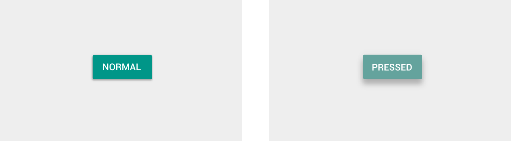

# 高度和阴影   

Material design 中的对象与现实生活中的对象具有相似的性质。在现实生活中，不同对象可以被堆积或粘贴起来，但是不能彼此交叉。对象自身塑造了自己的阴影并返回自己的光影。

依据这些性质所构造出来的空间模型对于用户来说是非常熟悉的，这一模型也可以被长期应用于移动应用当中。支撑这一空间模型的正是“高度”（Elevation）和“光影”（Shadows）这两个概念。

> 高度（安卓）  
> 阴影  
> 元素关系  

## 高度（安卓）   

高度是在 Z 轴上两个不同平面之间的一种相对深度或距离。

**详述：**

- “高度”的度量单位与 XY 轴的度量单位相同，主要是 DP。由于所有 Material 元素都具有 1 单位 DP 的厚度，所以“高度”度量的是从一个平面顶部到另一个平面顶部的距离。
- 一个子对象的高度与其父对象的高度相关。

这里是一些与安卓应用相关的图表和数据。

```
阴影影响
为自定义元素定义“阴影”
```

    

两个对象间的多种高度度量

### 静止高度   

所有 Material 对象除去大小之外，还有一个“静止高度”，或者称“默认高度”，它是不会变化的。当一个对象的高度产生变化时，它将会尽快恢复到自身的静止高度。

#### 组件高度   

- 某一元素类型的静止高度在移动应用中是一个常量。（比如，FAB 高度不会在某一个应用中是 6 dp 而在另一个应用中是 16 dp）   

- 元素在某一平台中可能会存在多种静止高度，这取决于环境的深度。（比如，TV 相比于移动端和桌面来说就具有更深的层次）

#### 感应高度与动态高度偏移   

一些元素类型拥有感应高度，也就是说它们会根据用户的输入（比如常规的、关注的和压制的）或系统事件来改变高度。这些高度的变化会通过动态高度偏移而不断生成。

动态高度偏移是某一元素移动的目标高度，它与该元素的静止状态有关。可以确定的是高度的变化在事件和元素类型中是持久发生的。比如说，所有通过按压来提升的元素相对于其静态高度来说都具有相似的高度变化。

一旦输入事件完成或被取消，那么元素将会恢复到它的静止高度上。

#### 避免高度冲突   

处于感应高度的元素当它在静止高度与动态高度偏移之间移动的时候可能会遇到其他的元素。由于 Material 不能相互交叉，没有任何一种方式能够让元素之间产生冲突，无论是基于均元素基础（per-component basis）还是通过使用完整应用布局。

在某一个元素水平上，元素可以在它们产生冲突之前提前移动或被移动。比如说，一个“浮动动作按钮”（FAB）可以在用户选择一张卡片之前消失或移出屏幕，或者它也可以在某一个 “snack bar” 出现时移动。

在布局水平上，你需要通过设计你的应用布局来将产生冲突的机会降到最低水平。比如说，可以通过将 FAB 置于某个卡片流的一端来避免当用户尝试获取某个卡片时所产生的冲突。

  
  

### 元素高度比较    

下面的图表对比了多种元素的静止高度和动态高度偏移。

    

在这一图表中，只有高度的尺寸和元素布局是精确的。其他尺寸和整体的元素布局只是为了说明而列出的。

   

一个包含卡片和FAB应用布局的实例与它在Z轴上元素高度的横截面图表。

    

一个包含开放导航抽屉的应用布局实例与它在Z轴上元素高度的横截面图表。

## 阴影    

“阴影”提供了对象深度和方向性移动的重要视觉线索。它们是唯一一种标示不同平面之间分离程度的视觉线索。某一对象的“高度”决定了其具体“阴影”的表现形式。

   

否。一旦没有了阴影，没有什么可以标示浮动动作按钮是从背景层分离出来的。

    

否。卷曲的阴影说明浮动动作按钮与“蓝层”（blue sheet）是两个分离开来的元素。然而，由于它们的阴影非常的相似以至于会被误认为它们在同一高度上。

     

是。更柔和、更大的阴影说明浮动动作按钮相比于拥有更卷曲阴影的“蓝层”（blue sheet）处于更高的高度之上。

在运动中，阴影提供了关于某个对象移动方向以及不同平面之间距离是否正在增加或减少的有用线索。

     

否。如果没有一个阴影来说明高度，那么就不能明确一个方形到底是它的自身尺寸在增加还是它的高度在增加。

    

是。当某一个对象的高度增加时其阴影会变得更柔和、更大，当其高度减小时，阴影会变得更卷曲。

    

是。在这一实例中，连贯的阴影帮助用户明白某一个对象看起来好像是它的高度在增加其实是它的形状在改变。

## 元素参考阴影    

下面的元素阴影应被用于标准参考。如果在说明中涉及任何关于下面的参考阴影和元素阴影的不同情况出现，那么都归于参考阴影。

**应用条**

4dp

  


**浮动按钮**

静态：2dp

敲击状态：8dp

  

**浮动动作按钮（FAB）**

静态：6dp

敲击状态：12dp

  

**卡片**

静态：2dp

选中状态：8dp

  

**菜单和子菜单**

菜单：8dp

子菜单：9dp（为子菜单增加 1dp）

  

**对话框**

24dp

  

**导航抽屉和右抽屉**

16dp

  

**底部单页**

16dp

  

**刷新按钮**

3dp

    

**快速查询/搜索条**

静止状态：2dp

滚动状态：3dp

     

**Snackbar**

6dp

    

**切换按钮**

1dp

  

## 对象关系   

### 对象层次   

你怎样去组织在某一应用中的对象或对象集合取决于它们怎样依据其他对象来移动。对象可以独立自主地移动或在受到比它更高层次对象限制的条件下移动。

所有对象都是以“父-子”关系描述的层级体系的一部分。“子”元素在这一关系体系中代表它们“父”元素的下级元素。对象可以是这一系统的“子”元素或其他对象的“子”元素。

“父-子”元素说明：
- 每一个对象只有一个“父”元素。
- 每一个对象可能会有任意数量的“子”元素。
- “子”元素继承来自“父”元素的可以转移的属性，比如位置、循环、刻度和高度。
- “兄弟”元素是指与某一对象处在同一层级的对象。

### 例外   

项目以根元素为父元素，比如主 UI 元素，它们相比于其他对象来说会自主移动。比如说，浮动动作按钮不会与内容一起转动。其他元素包括：
- 一个应用的边导航抽屉
- 动作条
- 对话

### 交互    

某个对象与其他对象交互的方式由它们在“父-子”层次中所处位置决定。

比如：
- “子”元素与其“父”元素在Z轴上的分离距离最近；其他对象不能插入父子元素之间。
- 在一个滚动的卡片集合中，所有卡片之间都是同层次的“兄弟”元素，因此它们就像坐在同一马车上的两个对象一样共同移动。它们都是控制它们移动的卡片集合对象的子元素。

### 高度   

你会如何确定某些对象的高度（即它们在 Z 空间的位置）取决于你想描述的内容层次以及某一个对象是否需要相对于其他对象自主移动。

<video crossorigin="anonymous"  loop  controls width="740" height="350">
<source src="http://materialdesign.eoemobile.com/WhatIsMaterial_ObjectsIn3DSpace_ObjectRelationships_01_RaisedChildButton_001.mp4">
</video>

随着父表的移动，升高的按钮（它的子元素）会伴随着它移出屏幕。

<video crossorigin="anonymous"  loop  controls width="740" height="350">
<source src="http://materialdesign.eoemobile.com/WhatIsMaterial_ObjectsIn3DSpace_ObjectRelationships_02_FAB_001.mp4">
</video>   

随着卡片集合卷出了屏幕，它的子卡片也会随之卷出屏幕。浮动动作按钮保留在某一地点因为它的父元素没有被卷动。
