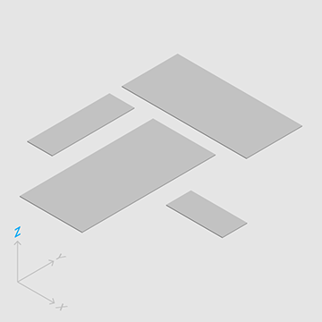
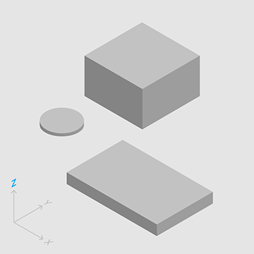
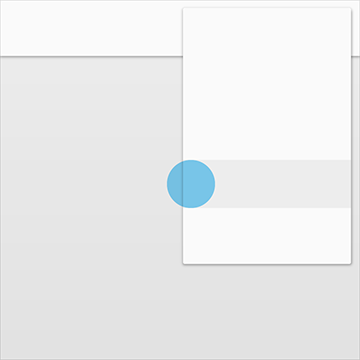
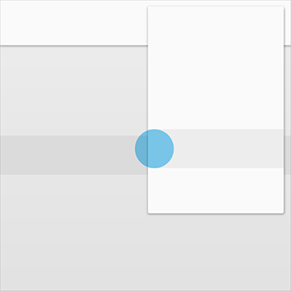
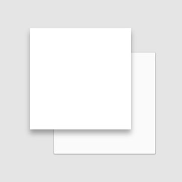
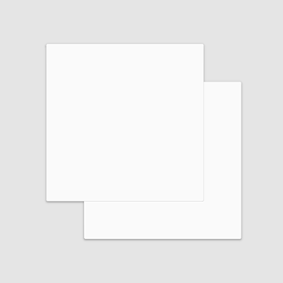

# Material 属性   

材料拥有确定不变的特性和固定的行为。了解这些特性将有助于你在一定程度上熟悉材料，这与 Material Design 的构想是一致的。    

## 物理特性

材料具有**变化的长宽尺寸**（以 dp 为计）和**均匀的厚度**（1dp）。

  

 (上图)可取

材料的高度和宽度是可变的。

 (上图)不可取

材料总是 1dp 厚。

材料会形成阴影。

阴影是由于材料元件之间的相对高度（Z 轴位置）而自然产生的。

<video crossorigin="anonymous"  loop  controls width="760" height="360">
<source src="http://materialdesign.qiniudn.com/videos/inline%20whatismaterial-materialprop-physicalprop-PaperShadow_01_xhdpi_008.mp4">
</video>

 (上图)可取

阴影描述材料元件之间的相对高度。

<video crossorigin="anonymous"  loop  controls width="760" height="360">
<source src="http://materialdesign.qiniudn.com/videos/inline%20whatismaterial-materialprop-physicalprop-PaperShadow_02_xhdpi_008.mp4">
</video>

 (上图)不可取

阴影随着材料高度的变化而产生变化。

内容可被以任何形状和颜色显示在材料上。

内容并不会增加材料的厚度。

<video crossorigin="anonymous"  loop  controls width="760" height="360">
<source src="http://materialdesign.qiniudn.com/videos/whatismaterial-materialprop-physicalprop-InkDisplay_xhdpi_006.mp4">
</video>

 (上图)可取

材料能展示任何形状和颜色。

内容的展示能够独立于材料,但要被限制在材料的范围里。

<video crossorigin="anonymous"  loop  controls width="760" height="360">
<source src="http://materialdesign.qiniudn.com/videos/whatismaterial-materialprop-physicalprop-InkBehavior_xhdpi_006.mp4">
</video>

 (上图)可取

内容的行为能独立于材料的行为。

材料是实物。

输入事件不能穿过材料。

  

 (上图)可取

输入事件只影响材料的前景。

  

 (上图)不可取

输入事件不能从材料下面穿过。

多个材料元件不能同时占用相同的空间点。

 

 (上图)可取

利用不同的高度区分材料元件是防止多个材料元件同时占用相同空间点的一个方法。

  

 (上图)不可取

多个材料元件不能同时占用相同的空间点。

材料不能穿过其他材料。

例如，一片材料不能在改变高度时穿过另一片材料。

<video crossorigin="anonymous"  loop  controls width="760" height="360">
<source src="http://materialdesign.qiniudn.com/videos/whatismaterial_properties_physical_07_xhdpi_009.mp4">
</video>

 (上图)不可取

材料不能穿过其他材料。

## 材料的变化

材料能改变形状。

<video crossorigin="anonymous"  loop  controls width="760" height="360">
<source src="http://materialdesign.qiniudn.com/videos/whatismaterial-materialprop-transformingmaterial-PaperShape_xhdpi_005.mp4">
</video>

材料能改变形状。

<video crossorigin="anonymous"  loop  controls width="760" height="360">
<source src="http://materialdesign.qiniudn.com/videos/whatismaterial-materialprop-transformingmaterial-PaperShapeLinear_xhdpi_005.mp4">
</video>

 (上图)可取

材料仅沿着它的水平面增长和收缩。

材料决不能弯曲或折叠。

<video crossorigin="anonymous"  loop  controls width="760" height="480">
<source src="http://materialdesign.qiniudn.com/videos/whatismaterial-materialprop-transformingmaterial-PaperBendFold_xhdpi_006.mp4">
</video>

 (上图)不可取

材料决不能弯曲或折叠。

几片材料能合在一起组成一片材料。

<video crossorigin="anonymous"  loop  controls width="760" height="480">
<source src="http://materialdesign.qiniudn.com/videos/whatismaterial-materialprop-transformingmaterial-PaperHeal_xhdpi_004.mp4">
</video>

几片材料能合在一起组成一片材料。

当材料被割开时，它还能自己复原。例如，你从一片材料中移除了一部分，这一片材料将再次变为一块完整的材料。

<video crossorigin="anonymous"  loop  controls width="760" height="480">
<source src="http://materialdesign.qiniudn.com/videos/whatismaterial-materialprop-transformingmaterial-PaperSplitHeal_xhdpi_005.mp4">
</video>

材料能被割开，还能再度变为完整。

## 材料的移动

材料能在环境中的任何地方自动产生或消失。

<video crossorigin="anonymous"  loop  controls width="760" height="480">
<source src="http://materialdesign.qiniudn.com/videos/whatismaterial-materialprop-movementmaterial-PaperPointExpand_xhdpi_005.mp4">
</video>

材料能自动产生或消失。

材料能沿任何轴移动。

<video crossorigin="anonymous"  loop  controls width="760" height="480">
<source src="http://materialdesign.qiniudn.com/videos/whatismaterial-materialprop-movementmaterial-PaperMove_xhdpi_008.mp4">
</video>

材料可以沿各个轴移动。

Z轴产生运动一般都是用户与材料交互而产生的。

<video crossorigin="anonymous"  loop  controls width="760" height="350">
<source src="http://materialdesign.qiniudn.com/videos/whatismaterial-materialprop-movementmaterial-Material_Response_xhdpi_003.mp4">
</video>

Z 轴的运动是由于用户的交互而产生的提示。

> 原文：[Material properties](https://www.google.com/design/spec/what-is-material/material-properties.html)  翻译：[seermole766](https://github.com/seermole766)  校对：
